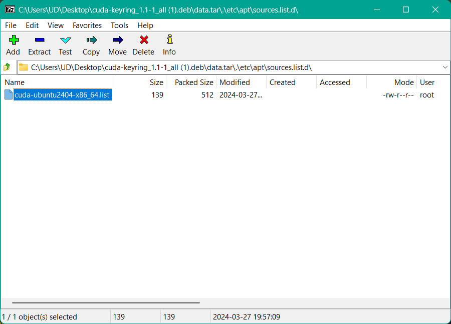

# Ошибки с доступностью apt пакетов

При обновлении списка пакетов через `apt update` и последующей их установке с использованием `apt upgrade` и/или при установке какой-либо системной библиотеки можно наткнуться на ошибку доступа, например:

```bash
ud@uduwpc:~/Documents/GitHub/ait2/labs/lab_1/data$ ./build.sh
Setting env vars
Docker image ubuntu:22.04 is found.
Building docker
[+] Building 0.4s (13/39)                                                                   docker:default
 => [internal] load build definition from OpenCVDockerFile.dockerfile                                 0.0s
 => => transferring dockerfile: 4.30kB                                                                0.0s
 => WARN: InvalidDefaultArgInFrom: Default value for ARG ubuntu:$ubuntu_ver results in empty or inva  0.0s
 => [internal] load metadata for docker.io/library/ubuntu:22.04                                       0.0s
 => [internal] load .dockerignore                                                                     0.0s
 => => transferring context: 2B                                                                       0.0s
 => [internal] load build context                                                                     0.0s
 => => transferring context: 34B                                                                      0.0s
 => [ 1/36] FROM docker.io/library/ubuntu:22.04                                                       0.0s
 => CACHED [ 2/36] RUN apt update && apt -y upgrade                                                   0.0s
 => CACHED [ 3/36] RUN mkdir /usr/local/Dev                                                           0.0s
 => CACHED [ 4/36] RUN apt install -y curl python3-testresources python3-dev wget gnupg2 software-pr  0.0s
 => CACHED [ 5/36] WORKDIR /usr/local/Dev/                                                            0.0s
 => CACHED [ 6/36] RUN curl https://bootstrap.pypa.io/get-pip.py -o get-pip.py && python3 get-pip.py  0.0s
 => CACHED [ 7/36] RUN apt -y install linux-headers-$(uname -r) build-essential                       0.0s
 => CACHED [ 8/36] RUN apt-key del 7fa2af80                                                           0.0s
 => ERROR [ 9/36] RUN wget https://developer.download.nvidia.com/compute/cuda/repos/ubuntu2204/x86_6  0.3s
------                                                                                                     
 > [ 9/36] RUN wget https://developer.download.nvidia.com/compute/cuda/repos/ubuntu2204/x86_64/cuda-keyring_1.1-1_all.deb:                                                                                            
0.123 --2025-01-15 23:47:31--  https://developer.download.nvidia.com/compute/cuda/repos/ubuntu2204/x86_64/cuda-keyring_1.1-1_all.deb                                                                                  
0.125 Resolving developer.download.nvidia.com (developer.download.nvidia.com)... 2.16.56.156, 2.16.56.144  
0.187 Connecting to developer.download.nvidia.com (developer.download.nvidia.com)|2.16.56.156|:443... connected.
0.266 HTTP request sent, awaiting response... 403 Forbidden
0.312 2025-01-15 23:47:31 ERROR 403: Forbidden.
0.312 
------

 1 warning found (use docker --debug to expand):
 - InvalidDefaultArgInFrom: Default value for ARG ubuntu:$ubuntu_ver results in empty or invalid base image name (line 2)
OpenCVDockerFile.dockerfile:24
--------------------
  22 |     RUN apt -y install linux-headers-$(uname -r) build-essential
  23 |     RUN apt-key del 7fa2af80
  24 | >>> RUN wget https://developer.download.nvidia.com/compute/cuda/repos/$cuda_distro/$cuda_arch/cuda-keyring_1.1-1_all.deb
  25 |     RUN dpkg -i cuda-keyring_1.1-1_all.deb
  26 |     RUN apt update
--------------------
ERROR: failed to solve: process "/bin/sh -c wget https://developer.download.nvidia.com/compute/cuda/repos/$cuda_distro/$cuda_arch/cuda-keyring_1.1-1_all.deb" did not complete successfully: exit code: 8
```

Ошибка:

```bash
 > [ 9/36] RUN wget https://developer.download.nvidia.com/compute/cuda/repos/ubuntu2204/x86_64/cuda-keyring_1.1-1_all.deb
 ...
0.187 Connecting to developer.download.nvidia.com (developer.download.nvidia.com)|2.16.56.156|:443... connected.
0.266 HTTP request sent, awaiting response... 403 Forbidden
0.312 2025-01-15 23:47:31 ERROR 403: Forbidden.
```

В данном случае доступ к репу Nvidia ограничен (*забанен по IP*).
> Выход &ndash; использование зеркала репа.

## Ubuntu &leq; 22.04

Список системных репов хранится в файле `/etc/apt/sources.list`. Стандартное содержимое:

```nano
deb http://archive.ubuntu.com/ubuntu/ jammy main restricted universe multiverse
# deb-src http://archive.ubuntu.com/ubuntu/ jammy main restricted universe multiverse

deb http://archive.ubuntu.com/ubuntu/ jammy-updates main restricted universe multiverse
# deb-src http://archive.ubuntu.com/ubuntu/ jammy-updates main restricted universe multiverse

deb http://archive.ubuntu.com/ubuntu/ jammy-security main restricted universe multiverse
# deb-src http://archive.ubuntu.com/ubuntu/ jammy-security main restricted universe multiverse

deb http://archive.ubuntu.com/ubuntu/ jammy-backports main restricted universe multiverse
# deb-src http://archive.ubuntu.com/ubuntu/ jammy-backports main restricted universe multiverse

deb http://archive.canonical.com/ubuntu/ jammy partner
# deb-src http://archive.canonical.com/ubuntu/ jammy partner
```

В данной строке:

```nano
deb http://archive.ubuntu.com/ubuntu/ jammy main restricted universe multiverse
```

- `deb` &ndash; означает тип репозитория, в данном случае Debian-based реп (Ubuntu основана на Debian)
- `http://archive.ubuntu.com/ubuntu/` &ndash; вэб-адрес репа
- `jammy` &ndash; кодовое обозначение версии дистрибутива Ubuntu 22.04
- `main restricted universe multiverse`:
  - `main` &ndash; официально поддерживаемое свободное ПО (*Officially Supported, Open-Source Software*)
  - `restricted` &ndash; поддерживаемое ПО, но которое не распространяются по свободной лицензии (*Officially Supported, Closed-Source Software*)
  - `universe` &ndash; свободное ПО, поддерживаемое сообществом, но без официальной поддержки (*Community-Maintained, Open-Source Software*)
  - `multiverse` &ndash; не бесплатное ПО без какой-либо поддержки (*Unsupported, Closed-Source and Patent-Encumbered Software*)
- `jammy-updates` &ndash; ветка обнов для Ubuntu 22.04 &asymp; рекомендуемые обновления
- `jammy-security` &ndash; ветка обнов безопасности для Ubuntu 22.04 &asymp; патчи, фиксящие проблемы безопасности ОС
- `jammy-backports` &ndash; ветка обнов софта для Ubuntu 22.04, который идет вместе с новой мажорной версией ОС, но скомпилированный для текущей (устаревшей) версии ОС
- `jammy-partner` &ndash; ветка обнов софта для Ubuntu 22.04, закрытое ПО без сорцов от третьей стороны, которое ***Canonical*** (разрабатывает, поддерживает и коммерциализирует Ubuntu и производные от Ubuntu дистрибутивы) тестирует и распространяет

Веб-адрес репа мы и можем заменить на зеркало. Например, на зеркало [Яндекса](https://mirror.yandex.ru/):
- https://mirror.yandex.ru/ubuntu/  
или зеркало [Timeweb](https://mirror.timeweb.ru/):
- http://mirror.timeweb.ru/  
или любое другое зеркало, которому ***вы доверяете***.

Обычно в ОС ручками правим файл в редакторе (бэкап файла не помешает): закомментируем строчку, продублируем и впишем новый адрес. Для сборки докер-образа подготовим файл заранее. [Пример файла](data/ubuntu_2204_mirrors.sources).  

### Nvidia CUDA

С CUDA несколько сложнее. Для цифровой подписи репа сначала устанавливается пакет `cuda-keyring_1.1-1_all.deb` после его скачивания:

```dockerfile
RUN dpkg -i cuda-keyring_1.1-1_all.deb
```

Недостаточно указать в [файле репов](data/ubuntu_2204_mirrors.sources) новое зеркало:

```nano
deb http://mirror.yandex.ru/mirrors/developer.download.nvidia.com/compute/cuda/repos/ubuntu2204/x86_64/ /
```

Ибо `cuda-keyring_1.1-1_all.deb`:
- устанавливает ключ цифровой подписи `cuda-archive-keyring.gpg` репа Nvidia в путь `\usr\share\keyrings\`
- добавляет официальный реп Nvidia в `/etc/apt/sources.list.d/cuda-ubuntu2204-x86_64.list`, его содержимое:
  ```nano
  deb [signed-by=/usr/share/keyrings/cuda-archive-keyring.gpg] https://developer.download.nvidia.com/compute/cuda/repos/ubuntu2204/x86_64/ /
  ```

Поэтому в докер-файле вместо

```dockerfile
RUN wget https://developer.download.nvidia.com/compute/cuda/repos/$cuda_distro/$cuda_arch/cuda-keyring_1.1-1_all.deb
RUN dpkg -i cuda-keyring_1.1-1_all.deb
RUN apt update
```

Нужно:
- скопировать [файл со списком репов](data/ubuntu_2204_mirrors.sources) внутрь образа
- заменить стандартный sources.list на наш с зеркалами
- заменить адрес для скачивания `cuda-keyring_1.1-1_all.deb` на зеркало
- установить `cuda-keyring_1.1-1_all.deb`
- заменить адрес репа в `/etc/apt/sources.list.d/cuda-ubuntu2204-x86_64.list` на зеркало
- дропнуть все сфетченные списки пакетов
- обновить списки `apt`'а

Кусок докер-файла должен выглядеть как-то так:

```dockerfile
RUN apt -y install linux-headers-$(uname -r) build-essential
RUN apt-key del 7fa2af80
COPY ubuntu_2204_mirrors.sources /usr/local/Dev
RUN cat ubuntu_2204_mirrors.sources > /etc/apt/sources.list
RUN wget http://mirror.yandex.ru/mirrors/developer.download.nvidia.com/compute/cuda/repos/$cuda_distro/$cuda_arch/cuda-keyring_1.1-1_all.deb
RUN dpkg -i cuda-keyring_1.1-1_all.deb
RUN echo "deb [signed-by=/usr/share/keyrings/cuda-archive-keyring.gpg] http://mirror.yandex.ru/mirrors/developer.download.nvidia.com/compute/cuda/repos/$cuda_distro/$cuda_arch/ /" > /etc/apt/sources.list.d/cuda-ubuntu2204-x86_64.list
RUN cat /etc/apt/sources.list.d/cuda-ubuntu2204-x86_64.list
RUN rm -rf /var/lib/apt/lists/*
RUN apt update
RUN apt install cuda-$cuda_ver -y
```

> В целом, имеет смысл заменить репы на зеркала в самом начале докер-файла, чтобы не дергать `apt update && upgrade` из официального репа, а потом менять репы, и что-то доустанавливать (вдруг зеркало отстает от основного репа в плане версии пакетов).

## Ubuntu 24.04+

В Убунте 24 поменялось расположение и формат файлов, описывающих репы для установки пакетов. Если выполнить `cat /etc/apt/sources.list`, то выведется содержимое файла &ndash; информационная заглушка:

```bash
ud@uduwpc:~$ cat /etc/apt/sources.list                                          
# Ubuntu sources have moved to /etc/apt/sources.list.d/ubuntu.sources
```

Содержимое `/etc/apt/sources.list.d/ubuntu.sources`:

```nano
Types: deb
URIs: http://archive.ubuntu.com/ubuntu/
Suites: noble noble-updates noble-backports
Components: main restricted universe multiverse
Signed-By: /usr/share/keyrings/ubuntu-archive-keyring.gpg

Types: deb
URIs: http://security.ubuntu.com/ubuntu/
Suites: noble-security
Components: main restricted universe multiverse
Signed-By: /usr/share/keyrings/ubuntu-archive-keyring.gpg
```

В данном случае все, что помещалось в одну строку в sources.list в Убунте 22.04, теперь распарсили в отдельные поля. Так же меняем адрес на зеркало (URIs), указываем путь к GPG ключу для подписи репа при необходимости.  

> Файл, содержащий путь к репу Nvidia, для Ubuntu 24.04 будет иметь другое название `cuda-ubuntu2404-x86_64.list`, полный путь: `\etc\apt\sources.list.d\cuda-ubuntu2404-x86_64.list`.  

Кстати, deb-пакет это по сути архив с метаинформацией. Его можно открыть архиватором и посмотреть содержимое. Например, содержимое `cuda-keyring_1.1-1_all.deb`:  

<div align="center">
  
  <p style="text-align: center">
    Рисунок 1 &ndash; Содержимое cuda-keyring_1.1-1_all.deb
  </p>
</div>

Можно посмотреть путь до файла с описанием репа дабы не искать его ручками после установки deb-пакета.