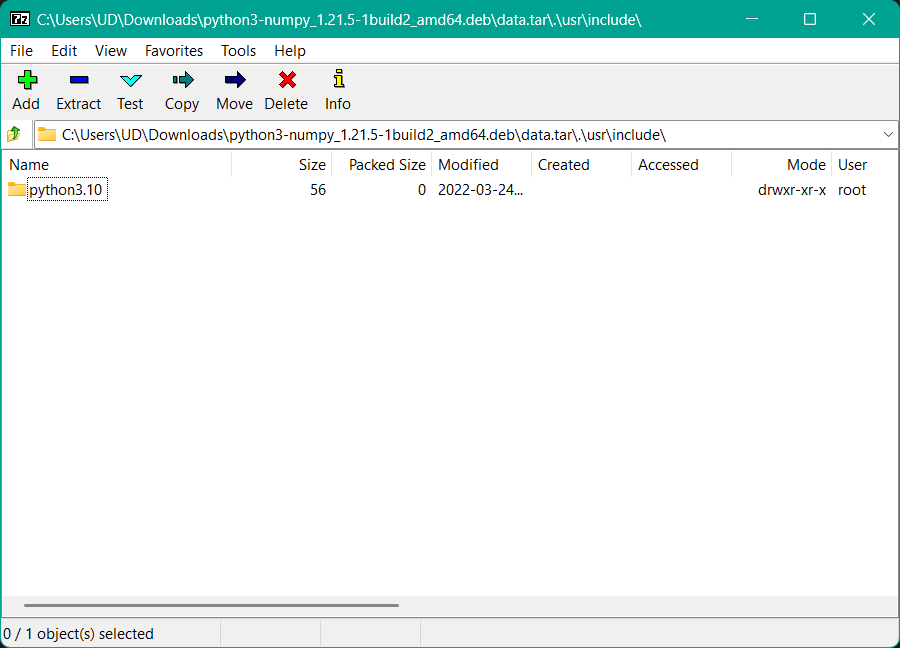
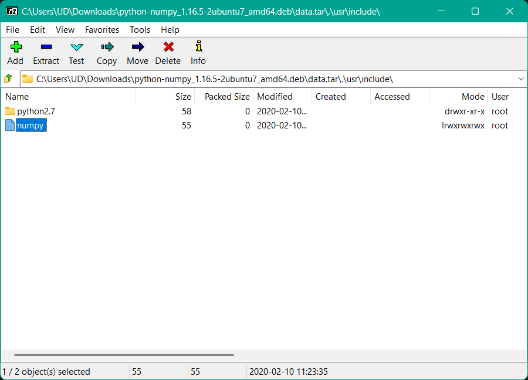

# Лабораторная работа №1: Docker. Сборка OpenCV

Лекции:
- [SSH](../../lectures/lecture_1/lecture_1.md)
- [Контейнеризация. Docker](../../lectures/lecture_2/lecture_2.md)

## Задание 0

С использованием пары ключей осуществить подключение к серверу, используя данные в `readme.txt`.

### Опционально

Настроить IDE для удобной работы на удаленной машине:
- [VS Code](vscode_remote.md)
- [PyCharm Pro](pycharm_remote.md)

## Задание 1

На базе образа [Ubuntu 22.04](https://hub.docker.com/_/ubuntu) или Ubuntu 24 создать Docker контейнер со сборкой [OpenCV](https://opencv.org/) с non free contrib модулями (пример из лекции).  
Рабочее сочетание версий (можно выбрать посвежее):
- Версия Убунты: 22.04
- OpenCV: 4.8.0
- CUDA: 12.2

Данные для сборки:
- скрипт сборки [build.sh](data/build.sh)
- скрипт [build_env.sh](data/build_env.sh) для задания определенных переменных среды (`environment vars`)
- докер файл [OpenCVDockerFile](data/OpenCVDockerFile.dockerfile)

1. Отредактировать скрипт сборки [build.sh](data/build.sh), заменить значения:
   - `image_tag` &ndash; название тега  
     > Дабы избежать пересечения в тегах, имеет смысл добавить уникальный префикс, пусть будет имя учетной записи: `stud<N>_<что угодно>`, где `<N>` &ndash; номер учетной записи на сервере.
   - `build_thread_count` &ndash; количество потоков для сборки библиотеки  
     > лучше указать $n - 1$, где $n$ &ndash; количество *физических* ядер CPU.
   - Версии Ubuntu, OpenCV, CUDA при желании  
   
   > Скрипт [build_env.sh](data/build_env.sh) использовать как есть, он необходим для установки питонячих путей для компиляции `OpenCV` и последующей установки библиотеки.  

2. C CUDA возможны различные приколы при установке, особенно на старые релизы типа `18.04`. Если в системе нет GPU Nvidia, то установку CUDA можно вырезать из скрипта сборки и докер файла.
   > На сервере GPU есть. Компиляция с использованием CUDA опциональна.  

3. Изменить права доступа, выдать разрешение для запуска скриптов `build.sh`, `build_env.sh`:  
   ```bash
   chmod +x build.sh
   chmod +x build_env.sh
   ```  

4. Дописать в конец [докер файла](data/OpenCVDockerFile.dockerfile) (перед `CMD`) команды для установки необходимых либ Python 3 при необходимости.  
   > Кроме `opencv-python` и `opencv-contrib-python`!  

5. Запустить `build.sh` для сборки контейнера.  

6. Реализовать [алгоритм обработки изображений](sub_task_opencv.md), скрипт на питоне положить в папку на хосте.  
   > Цель реализации достаточно тривиального алгоритма из данного подзадания &ndash; проверка работоспособности Python-обертки собранного из исходников OpenCV.

7. Запустить контейнер командой:
   ```bash
   docker run -v <путь на хосте>:<путь внутри контейнера> -it <имя тега>
   ```

8. Запустить скрипт с реализованным алгоритмом в контейнере в примонтированной внутри контейнера папке.  
   Результат обработки сохранить в локальной директории контейнера.  

9. Убедиться в появлении результата в директории хоста (на сервере).

## Примечание

Самостоятельная сборка `OpenCV` из исходников необходима для использования проприетарных "небесплатных" алгоритмов, лицензия которых не совместима с `Apache-2.0 license` основных модулей. Код дополнительных экспериментальных модулей расположен в отдельном репе [Repository for OpenCV's extra modules](https://github.com/opencv/opencv_contrib), в который включены и non-free модули. Например, патент на алгоритм [SIFT](https://docs.opencv.org/4.x/da/df5/tutorial_py_sift_intro.html) истек в 2020 году, и теперь данный алгоритм переехал в основные модули. А патент на [SURF](https://en.wikipedia.org/wiki/Speeded_up_robust_features) действителен, и для коммерческого использования его необходимо [лицензировать](https://github.com/herbertbay/SURF#License-1-ov-file).

## Troubleshooting

[OpenCVDockerFile.dockerfile](data/OpenCVDockerFile.dockerfile) содержит инструкции для сборки образа для Ubuntu 20.04. При сборке под Ubuntu 22.04 возникают ошибки, описанные в данном разделе.

### Предупреждение об отсутствии значения по умолчанию для параметра `ubuntu_ver`

Так как данный параметр используется в команде `FROM`:

```dockerfile
ARG ubuntu_ver=22.04
FROM ubuntu:$ubuntu_ver
```

то при его отсутствии (`docker build ... --build-arg ubuntu_ver=$ubuntu_ver ...`) как минимум непонятно, какой образ тянуть из репа (скорее всего `latest`). Ну и пострадают зависящие от него команды. Так что имеет смысл добавить значение по умолчанию:

```dockerfile
ARG ubuntu_ver=22.04
FROM ubuntu:$ubuntu_ver
```

### Отключение интерактивного выбора страны/раскладки клавиатуры

Согласно [docker build with Ubuntu 18.04 image hangs after prompting for Country of origin for keyboard](https://stackoverflow.com/questions/63476497/docker-build-with-ubuntu-18-04-image-hangs-after-prompting-for-country-of-origin) в докер-файле можно указать переменную среды и выполнить еще и системную команду для контрольного выстрела:

```dockerfile
ENV DEBIAN_FRONTEND=noninteractive
RUN echo 'debconf debconf/frontend select Noninteractive' | debconf-set-selections
```

> Такие переменные и команды могут отличаться от релиза к релизу внутри одного семейства дистрибутивов.

### Ошибки с доступностью apt пакетов

Общая инструкция для добавления зеркал репов и более подробный разбор, как добавить зеркало репа Nvidia для установки драйверов, CUDA и прочего: [инструкция по добавлению зеркал репов](apt_mirrors.md).

### Отсутствие некоторых пакетов

Структура зависимостей различных пакетов может измениться при переходе от одной мажорной версии дистрибутива к другой, в результате чего "старая" инструкция по установке зависимостей потребует обновления. Например, в 22 версии Убунты отсутствуют некоторые пакеты, которые были доступны в 20 версии:

> Package 'gstreamer1.0-doc' has no installation candidate

В Ubuntu 22.04 данный пакет не обнаружен. Можно воспользоваться сервисом [Launchpad](https://launchpad.net/ubuntu) для поиска пакетов. [Да, такого пакета в Jammy нет](https://launchpad.net/ubuntu/jammy/+search?text=gstreamer1.0-doc).

Полный список "утраченных" пакетов:
- gstreamer1.0-doc
- python-dev
- libdc1394-22-dev
- python-numpy

### Python библиотеки

#### Специфика Ubuntu 24.04

В Ubuntu 24.04 при выполнении инструкции из докер-файла (установка системного `pip3`):

```dockerfile
RUN curl https://bootstrap.pypa.io/get-pip.py -o get-pip.py && python3 get-pip.py
```

Выскочит ошибка:

```bash
ud@uduwpc:~/Dev$ python3 get-pip.py 
error: externally-managed-environment

× This environment is externally managed
╰─> To install Python packages system-wide, try apt install
    python3-xyz, where xyz is the package you are trying to
    install.
    
    If you wish to install a non-Debian-packaged Python package,
    create a virtual environment using python3 -m venv path/to/venv.
    Then use path/to/venv/bin/python and path/to/venv/bin/pip. Make
    sure you have python3-full installed.
    
    If you wish to install a non-Debian packaged Python application,
    it may be easiest to use pipx install xyz, which will manage a
    virtual environment for you. Make sure you have pipx installed.
    
    See /usr/share/doc/python3.12/README.venv for more information.

note: If you believe this is a mistake, please contact your Python installation or OS distribution provider. You can override this, at the risk of breaking your Python installation or OS, by passing --break-system-packages.
hint: See PEP 668 for the detailed specification.
```

Для установки системных Python-либ нужно использовать `apt`: `apt install python3-pip`, `apt install python3-numpy`, `apt install python3-setuptools` и т.п. В целом, навязывают использование виртуального окружения.

#### `distutils`

Потенциальная будущая проблема &ndash; библиотека `distutils`:

```bash
#50 0.241 <string>:1: DeprecationWarning: The distutils package is deprecated and slated for removal in Python 3.12. Use setuptools or check PEP 632 for potential alternatives
#50 0.242 <string>:1: DeprecationWarning: The distutils.sysconfig module is deprecated, use sysconfig instead
```

На очереди модификация [build_env.sh](data/build_env.sh), в которой `distutils` используется для вывода путей до `/include` и `/lib`.

### Numpy

Данный фрагмент лишний (в системном репе Ubuntu 22.04 `python3-numpy` версии 1.21.5, а в [PyPI](https://pypi.org/project/numpy/) версия 2.2.1):

```dockerfile
### Update numpy

RUN pip3 install -U numpy
```

#### fatal error: numpy/ndarrayobject.h: No such file or directory

При возникновении ошибки [fatal error: numpy/ndarrayobject.h: No such file or directory](https://github.com/opencv/opencv/issues/11709) в процессе компиляции обычно советуют доустановить `python-numpy`, который в Ubuntu 22.04 отсутствует. В одном ответе на гитхабе и ответах на похожие вопросы на StackOverflow советуют создать символьную ссылку на папку `numpy/core/include` с заголовочными C/C++ файлами в путях интерпретатора Python3 в стандартный путь `/usr/include/numpy`.

Все дело в отличии `python3-numpy` от `python-numpy`:

<div align="center">
  
  <p style="text-align: center">
    Рисунок 1 &ndash; Содержимое python3-numpy_1.21.5-1build2_amd64.deb в Ubuntu 22.04
  </p>
  <br>
   vs
  <br>
  <br>
  
  <p style="text-align: center">
    Рисунок 2 &ndash; Содержимое python-numpy_1.16.5-2ubuntu7_amd64.deb в Ubuntu 20.04
  </p>
</div>

`python-numpy` при установке создает символьную ссылку, а `python3-numpy` &ndash; нет. Добавим вручную перед конфигурированием сборки `cmake`'ом:

```dockerfile
RUN apt-cache show cuda

RUN ln -s ${py3_np_inc_dirs}/numpy /usr/include/numpy

RUN . /usr/local/Dev/build_env.sh && cmake_command="-D CMAKE_BUILD_TYPE=RELEASE \
```


### Отладка при сборке образа

#### Вывод в консоль результата выполнения команды из `bash`

##### Способ 1

Если нужно вывести результат выполнения команды (`ls`, `echo`, `cat` и т.п.) или содержимое файла, то при сборке образа нужно указать один или два флага:
```bash
--progress=plain --no-cache
```

Первый отключает красивый вывод лога и выводит весь лог построчно как в старые добрые времена.  
Второй отключает кэширование, то есть ***пересобираться образ будет с 0***! Второй флаг нужен, если необходимо вывести результат команды, а слой образа уже закэширован (другими словами, из кэшированного слоя команда вывода в лог докера второй раз не сработает).

##### Способ 2

Например, процесс компиляции библиотеки падает с ошибкой (не найден файл и т.п.). Вместо отладочной печати в консоль без сохранения кэша слоев образа:
- можно сохранить необходимые логи в файл, выполнить различные команды с сохранением результата выполнения в файл
- переписать докер-файл на [многоступенчатую сборку с экспортным слоем](../../lectures/lecture_2/lecture_2.md#28-многоступенчатая-сборка-образов), который представляет собой пустой образ с экспортом данных из образа предыдущего шага на хост ОС

Выше перечисленные патчи докер-файла должны привести к успешной сборке образа. Многоступенчатая сборка позволила отладить некоторые косяки. Инструкция по отладке: [многоступенчатая сборка образа с экспортным слоем (отладка)](multi_stage_build_debug.md).