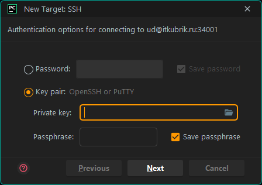

# Настройка remote development в PyCharm Pro

> Поддержка Remote development есть только в платной версии PyCharm: [PyCharm Professional vs. Community Edition](https://www.jetbrains.com/pycharm/editions/).

Для запуска локального кода на удаленной машине (сервере) необходимо сначала добавить интерпретатор Python через SSH туннель. Для этого можно кликнуть по текущему интерпретатору проекта в основном окне IDE с открытым текущим проектом:  

  
  

    Рисунок 1 &ndash; Добавление интерпретатора Python через SSH туннель
  

В меню выбрать существующий интерпретатора Python через SSH туннель или новый `Add New Interpreter`:  

  
   
  
   
  

    Рисунок 2 &ndash; Добавление интерпретатора Python через SSH туннель
  

Далее необходимо ввести имя хоста (сервера), номер SSH порта и имя учетной записи для подключения к серверу:  

  
  

    Рисунок 3 &ndash; Добавление интерпретатора Python через SSH туннель: данные для подключения
  

Далее в следующем окне wizard'а вместо пароля `Password` необходимо выбрать ключевую пару `Key pair` и указать путь к приватному ключу. Поле `Passphrase` оставить пустым:  

  
  

    Рисунок 4 &ndash; Добавление интерпретатора Python через SSH туннель: данные для подключения
  

После успешного подключения нужно выбрать, какой интерпретатор использовать: системный или виртуальное окружение. Выбираем виртуальное окружение:  

  
  

    Рисунок 5 &ndash; Добавление интерпретатора Python через SSH туннель: данные для подключения
  

В поле `Location` указывается папка с виртуальным окружением. По умолчанию имя конечной папки &ndash; название текущего открытого проекта. В данной папке будет храниться виртуальное окружение, изолированное от системного интерпретатора. В поле `Sync folders` жмем на кнопку выбора путей:  

  
  

    Рисунок 6 &ndash; Добавление интерпретатора Python через SSH туннель: выбор путей для синхронизации проекта между локальной и удаленной машиной
  

`Local Path` &ndash; путь к папке с текущим проектом на локальной машине. `Remote Path` &ndash; путь к папке с текущим проектом на удаленной машине. В поле `Remote Path` жмем на кнопку выбора, откроется окно выбора директории:  

  
  

    Рисунок 7 &ndash; Добавление интерпретатора Python через SSH туннель: выбор путей для синхронизации проекта между локальной и удаленной машиной
  

В данном примере выбрана папка в домашнем каталоге учетной записи пользователя. Жмем `OK`. `PyCharm` начнет установку параметров виртуального окружения, индексировать либы и т.п.

Теперь можно залить весь проект на сервер:  

  
  

    Рисунок 8 &ndash; Deploy проекта на сервер
  

Также можно залить на удаленную машину любой файл проекта:  

  
  

    Рисунок 9 &ndash; Upload файла на сервер
  

Или скачать с удаленной машины на локальный ПК:  

  
  

    Рисунок 10 &ndash; Download файла на сервер
  

По клику на таб `Terminal` открывается панель с консолью, в данном случае локальной машины:  

  
  

    Рисунок 11 &ndash; Вкладка <b>Terminal</b>: консоль локальной машины
  

Однако, можно открыть терминал и на удаленной машине. Для этого в меню `Tools` &rarr; `Start SSH Session...` необходимо выбрать новую сессию вида `user@server:port`:  

  
   
  
   
  

    Рисунок 12 &ndash; Запуск новой сессии SSH
  

Откроется терминал удаленной машины:

  
  

    Рисунок 13 &ndash; Вкладка <b>Terminal</b>: консоль удаленной машины
  

Profit! :sunglasses: