# Настройка remote development в Visual Studio Code

Сначала установим плагины для поддержки Python в Visual Studio Code:  

<div align="center">
  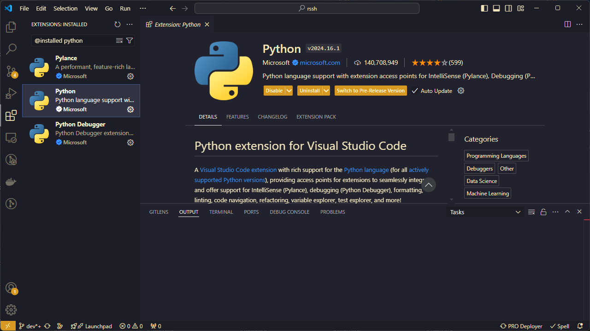
  <p style="text-align: center">
    Рисунок 1 &ndash; Extensions: <b>Python, Python Debugger, Pylance</b>
  </p>
</div>

Далее нам понадобится набор плагинов `Remote Development`:  

<div align="center">
  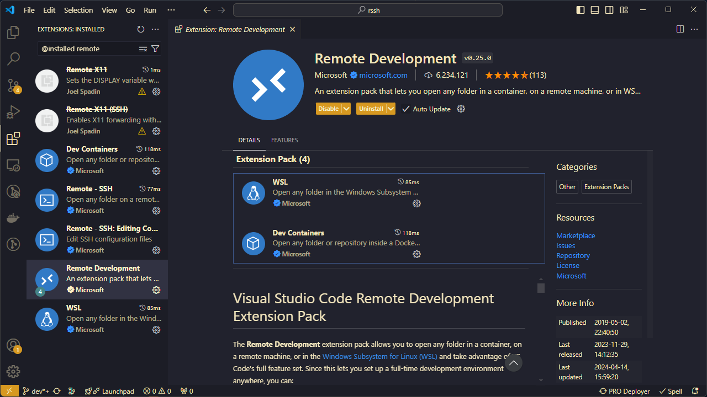
  <p style="text-align: center">
    Рисунок 2 &ndash; Extensions: <b>Remote Development</b>
  </p>
</div>

Плагин `Docker`:  

<div align="center">
  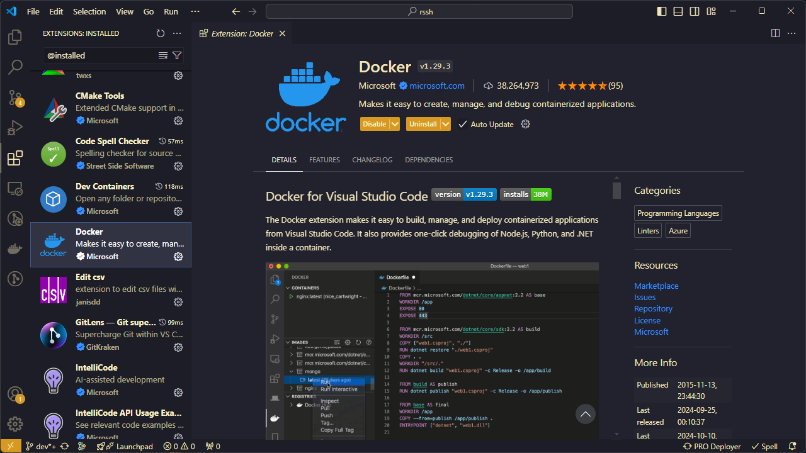
  <p style="text-align: center">
    Рисунок 3 &ndash; Extensions: <b>Docker</b>
  </p>
</div>

Плагин `Dev Containers`:  

<div align="center">
  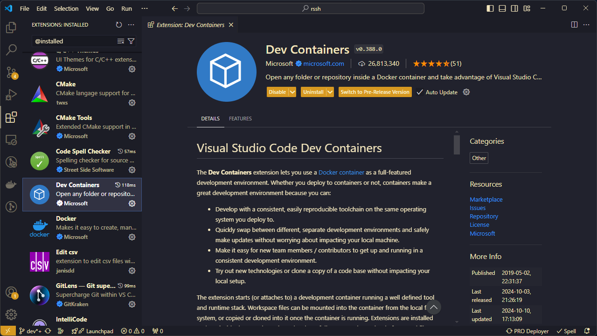
  <p style="text-align: center">
    Рисунок 4 &ndash; Extensions: <b>Dev Containers</b>
  </p>
</div>

Плагин `Pro Deployer` для синхронизации файлов между локальной и удаленной машиной:  

<div align="center">
  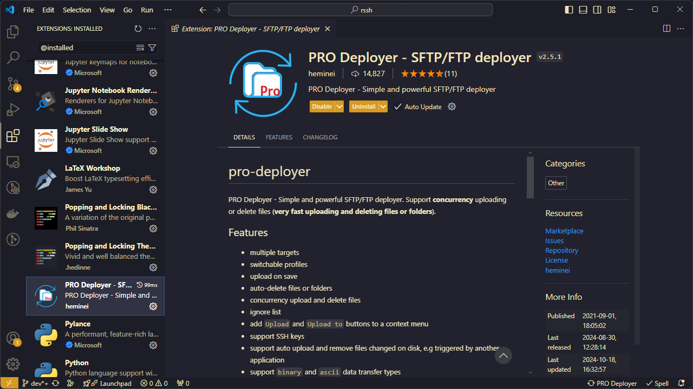
  <p style="text-align: center">
    Рисунок 5 &ndash; Extensions: <b>Dev Containers</b>
  </p>
</div>

> Опционально. Удобного способа синхронизировать файлы в VS Code нет. Можно, конечно, это делать в отдельном SSH клиенте с поддержкой SFTP или отдельном SFTP клиенте вручную.

Для подключения к удаленной машине необходимо вызвать командную панель по `F1` и ввести первые символы из `remote-ssh`:  

<div align="center">
  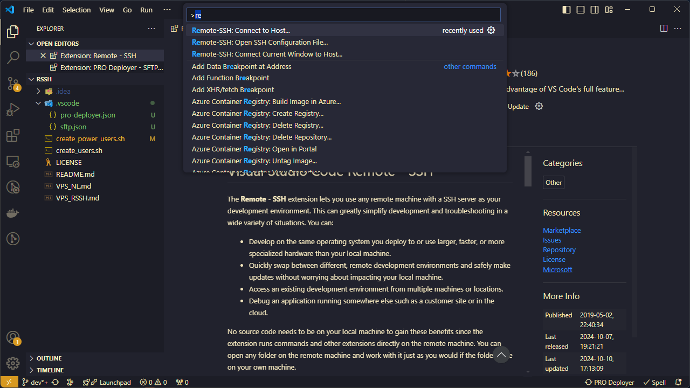
  <p style="text-align: center">
    Рисунок 6 &ndash; VS Code: remote SSH
  </p>
</div>

В открывшемся выпадающем списке нужно выбрать подключение (псевдоним параметров подключения в `~/.ssh/config` на локальной машине):  

<div align="center">
  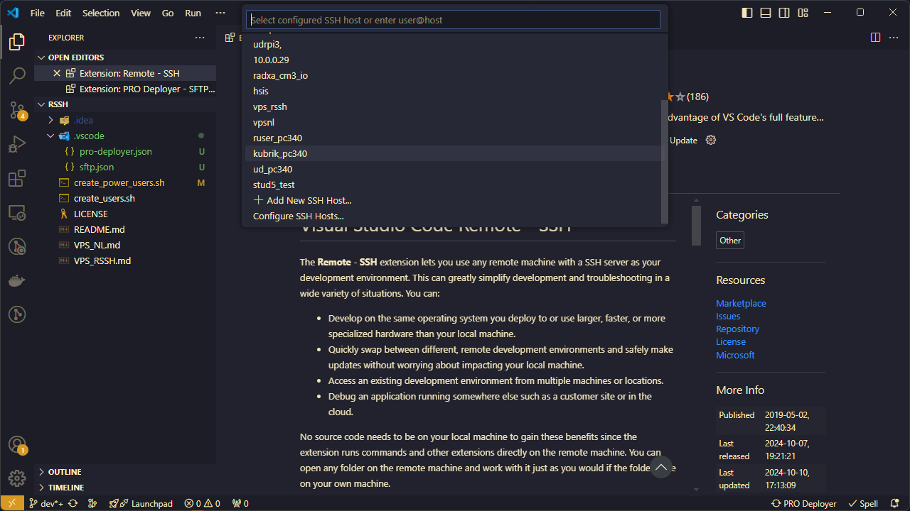
  <p style="text-align: center">
    Рисунок 7 &ndash; VS Code: remote SSH
  </p>
</div>

Далее необходимо вручную указать платформу удаленной машины:  

<div align="center">
  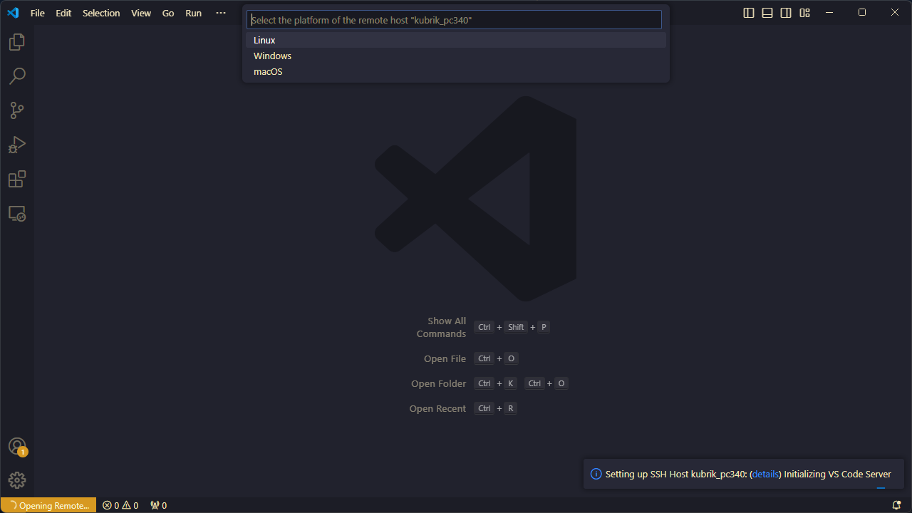
  <p style="text-align: center">
    Рисунок 8 &ndash; VS Code: remote SSH
  </p>
</div>

Далее согласиться на подключение (проверка цифрового отпечатка удаленного хоста). Вуаля, новое окно VS Code открылось с установленным подключением (в левом нижнем углу отобразится надпись `SSH: <имя в конфиге>`):  

<div align="center">
  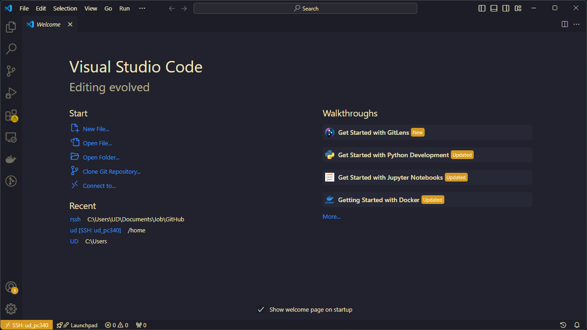
  <p style="text-align: center">
    Рисунок 9 &ndash; VS Code: remote SSH success
  </p>
</div>

На вкладке проводника (*Explorer*) можно открыть папку или склонировать реп:  

<div align="center">
  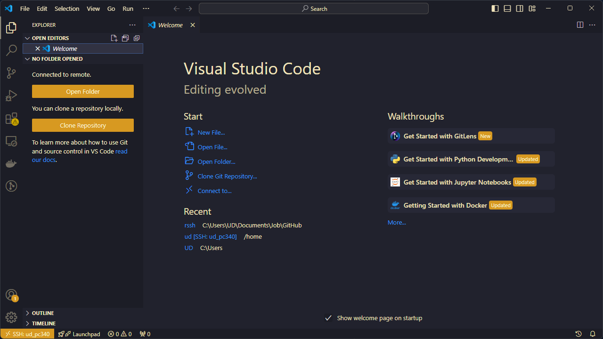
  <p style="text-align: center">
    Рисунок 10 &ndash; VS Code: проводник на удаленной машине
  </p>
</div>

Открываем нужную папку:  

<div align="center">
  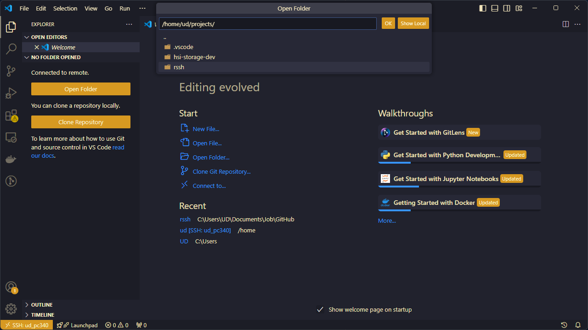
  <p style="text-align: center">
    Рисунок 11 &ndash; VS Code: проводник на удаленной машине
  </p>
</div>

Проект на удаленном сервере открыт:

<div align="center">
  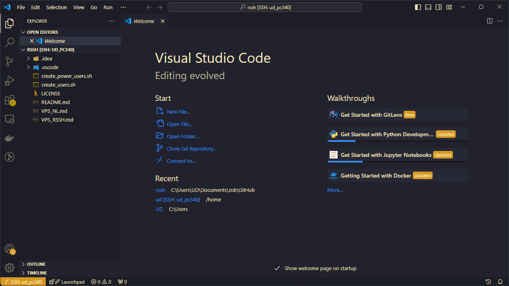
  <p style="text-align: center">
    Рисунок 12 &ndash; VS Code: папка с проектом на удаленной машине
  </p>
</div>

Теперь настроим синхронизацию. Для этого в командной панели (`F1`) введем первые символы `Pro Deployer` и выберем `Pro Deployer: Generate Config File` в первом окне VS Code:

<div align="center">
  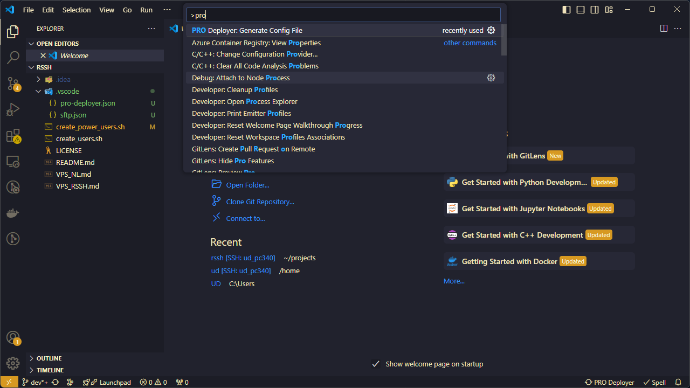
  <p style="text-align: center">
    Рисунок 13 &ndash; <b>Pro Deployer</b>: создание конфига
  </p>
</div>

В папке проекта в директории `/.vscode` создастся файл `pro-deployer.json`:

<div align="center">
  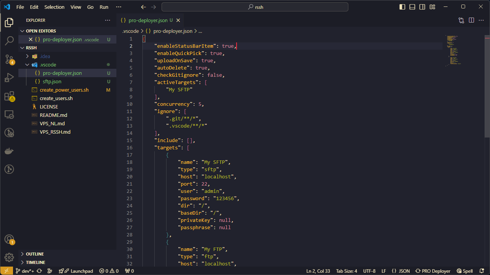
  <p style="text-align: center">
    Рисунок 14 &ndash; <b>Pro Deployer</b>: конфиг с настройками по умолчанию
  </p>
</div>

Содержимое стандартного конфига:

```json
{
	"enableStatusBarItem": true,
	"enableQuickPick": true,
	"uploadOnSave": true,
	"autoDelete": true,
	"checkGitignore": false,
	"activeTargets": [
		"My SFTP"
	],
	"concurrency": 5,
	"ignore": [
		".git/**/*",
		".vscode/**/*"
	],
	"include": [],
	"targets": [
		{
			"name": "My SFTP",
			"type": "sftp",
			"host": "localhost",
			"port": 22,
			"user": "admin",
			"password": "123456",
			"dir": "/",
			"baseDir": "/",
			"privateKey": null,
			"passphrase": null
		},
		{
			"name": "My FTP",
			"type": "ftp",
			"host": "localhost",
			"port": 21,
			"user": "admin",
			"password": "123456",
			"dir": "/",
			"baseDir": "/",
			"transferDataType": "binary"
		}
	]
}
```

В `targets` необходимо поменять:
- `name` &ndash; название блока настроек для удаленного сервера
- `type` &ndash; тип протокола &ndash; `sftp`
- `host` &ndash; имя хоста или IP-адрес (из `readme.txt`)
- `port` &ndash; номер SSH порта
- `user` &ndash; имя учетной записи на удаленной машине
- `password` &ndash; пароль для SSH подключения, в нашем случае значение &ndash; `null` (без кавычек)
- `dir` &ndash; директория на удаленной машине, в которую будут заливаться файлы с локального хоста
- `baseDir` &ndash; дополнительный относительный путь, в нашем случае &ndash; `"/"`
- `privateKey` &ndash; абсолютный путь до приватного ключа
- `passphrase` &ndash; пароль для приватного ключа, в нашем случае &ndash; `null` (без кавычек)

Второй таргет с названием `My FTP` можно удалить.  

Пример готового конфига:  

```json
{
	"enableStatusBarItem": true,
	"enableQuickPick": true,
	"uploadOnSave": true,
	"autoDelete": true,
	"checkGitignore": false,
	"activeTargets": [
		"ud_pc340"
	],
	"concurrency": 5,
	"ignore": [
		".git/**/*",
		".vscode/**/*"
	],
	"include": [],
	"targets": [
		{
			"name": "ud_pc340",
			"type": "sftp",
			"host": "itkubrik.ru",
			"port": 34001,
			"user": "ud",
			"password": null,
			"dir": "/home/ud/projects/rssh",
			"baseDir": "/",
			"privateKey": "C:/Users/UD/.ssh/id_ed25519_pc340_ud",
			"passphrase": null
		}
	]
}
```

Сохраняем. Теперь в командной панели выбираем `Upload`:  

<div align="center">
  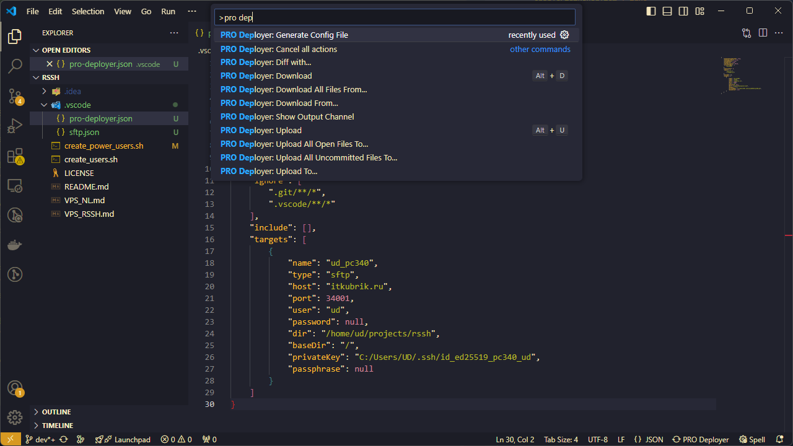
  <p style="text-align: center">
    Рисунок 15 &ndash; <b>Pro Deployer</b>: командная панель
  </p>
</div>

Также можно это сделать из контекстного меню в панели проводника или в контекстном меню конкретного файла:  

<div align="center">
  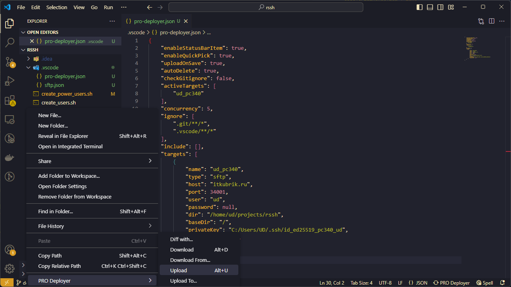
  <p style="text-align: center">
    Рисунок 16 &ndash; <b>Pro Deployer</b>: загрузка файла с локального хоста (<b>Upload</b>)
  </p>
</div>

При выборе пункта меню `Upload To..` или `Download From...` необходимо выбрать в списке имя таргета.  

В окне с подключением к удаленной машине можно открыть терминал:

<div align="center">
  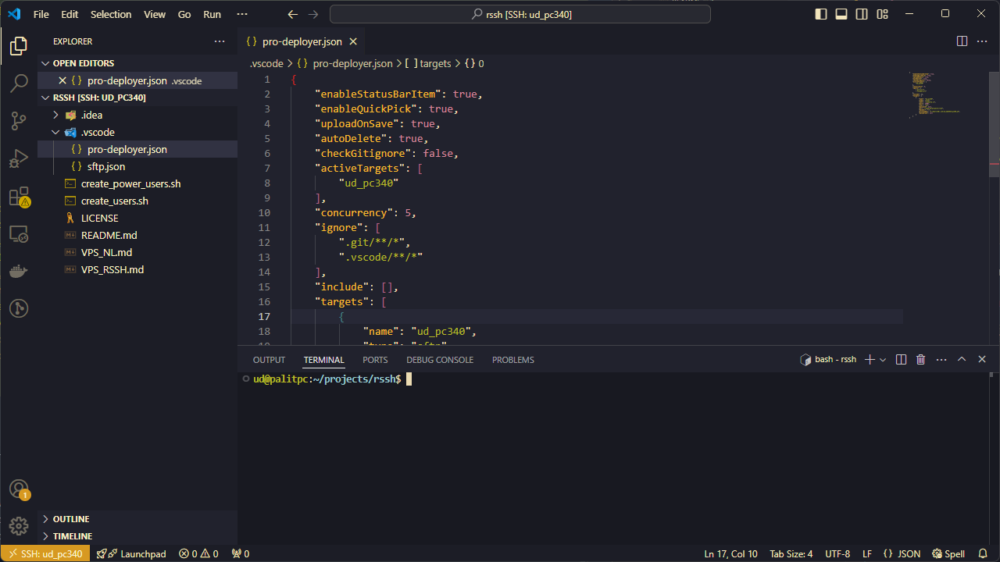
  <p style="text-align: center">
    Рисунок 17 &ndash; VS Code: терминал удаленного хоста
  </p>
</div>

## Примечания

1. Держать открытым еще одно окно для ручной синхронизации файлов неудобно. Возможно, проще отдельным клиентом пользоваться.

2. Есть и другие SFTP плагины. В похожем плагине не удалось подключиться с использованием ключевой пары. Параметры конфига похожие.

3. В `Pro Deployer` параметр `"uploadOnSave": true` отвечает за автоматическую загрузку файла на ***активный*** таргет при его изменении. В аналогичном плагине был некий `watcher`, отслеживающий изменения. В репе другого плагина были нарекания, так что надо смотреть `issue`'зы.