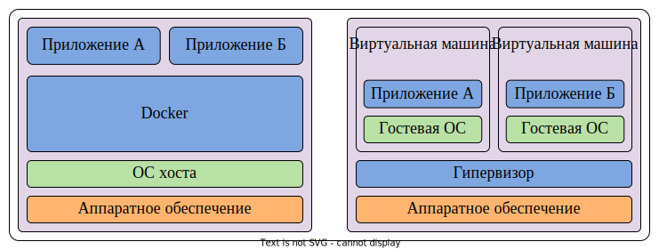
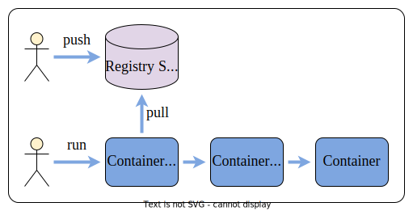

# Технологии искусственного интеллекта. Семестр 2

© Петров М.В., старший преподаватель кафедры киберфотоники, Самарский университет

## Лекция 2. Контейнеризация. Docker

### Содержание

1. [Введение](#21-введение)
2. [Контейнер](#22-контейнер)
3. [Работа с Docker](#23-работа-с-docker)
4. [Хранение данных](#24-хранение-данных)
5. [Создание образа с использованием Dockerfile](#25-создание-образа-с-использованием-dockerfile)
6. [Синтаксис докер-файла](#26-синтаксис-докер-файла)
7. [Пример докер-файла](#27-пример-докер-файла)
8. [Многоступенчатая сборка образов](#28-многоступенчатая-сборка-образов)

### 2.1 Введение

Источники:
 - [Полное практическое руководство по Docker: с нуля до кластера на AWS @ Хабр](https://habr.com/ru/articles/310460/)
 - [Основы контейнеризации (обзор Docker и Podman) @ Хабр](https://habr.com/ru/articles/659049/)
 - [Руководство по Docker Compose для начинающих @ Хабр](https://habr.com/ru/companies/ruvds/articles/450312/)

> [Docker](https://ru.wikipedia.org/wiki/Docker) &ndash; программное обеспечение для автоматизации развёртывания и управления приложениями в средах с поддержкой контейнеризации, контейнеризатор приложений. Позволяет "упаковать" приложение со всем его окружением и зависимостями в контейнер, который может быть развёрнут на любой Linux-системе с поддержкой контрольных групп в ядре, а также предоставляет набор команд для управления этими контейнерами. Изначально использовал возможности `LXC`, с 2015 года начал использовать собственную библиотеку, абстрагирующую виртуализационные возможности ядра Linux &ndash; `libcontainer`. С появлением `Open Container Initiative` начался переход от монолитной к модульной архитектуре. Разрабатывается и поддерживается одноимённой компанией-стартапом, распространяется в двух редакциях &ndash; общественной (Community Edition) по лицензии Apache 2.0 и для организаций (Enterprise Edition) по проприетарной лицензии. Написан на языке `Go`.

Докер это инструмент, который позволяет разработчикам, системным администраторам и другим специалистам деплоить приложения в песочнице (которая называются контейнером), для запуска на целевой операционной системе, например, Linux. Ключевое преимущество докера в том, что он позволяет пользователям упаковывать приложение со всеми его зависимостями в стандартизированный модуль для разработки. В отличие от виртуальных машин, контейнеры не создают такой дополнительной нагрузки, поэтому с ними можно использовать систему и ресурсы более эффективно.

#### История

Идея изоляции пользовательских пространств берет свое начало в 1979 году, когда в ядре UNIX появился системный вызов `chroot`. Он позволял изменить путь каталога корня `/` для группы процессов на новую локацию в файловой системе, то есть фактически создавал новый корневой каталог, который был изолирован от первого. Следующим шагом и логическим продолжением `chroot` стало создание в 2000 году FreeBSD `jails` ("тюрем"), в которых изначально появилась частичная изоляция сетевых интерфейсов. В первой половине нулевых технологии виртуализации на уровне ОС активно развивались &ndash; появились *Linux VServer* (2001), *Solaris Containers* (2004) и *OpenVZ* (2005).

В операционной системе Linux технологии изоляции и виртуализации ресурсов вышли на новый этап в 2002 году, когда в ядро было добавлено первое пространство имен для изоляции файловой системы &ndash; `mount`. В 2006-2007 годах компанией Google был разработан механизм *Process Containers* (позднее переименованный в `cgroups`), который позволил ограничить и изолировать использование группой процессов ЦПУ, ОЗУ и др. аппаратных ресурсов. В 2008 году функционал `cgroups` был добавлен в ядро Linux. Достаточная функциональность для полной изоляции и безопасной работы контейнеров была завершена в 2013 году с добавлением в ядро пространства имен пользователей &ndash; `user`.

В 2008 году была представлена система `LXC` (*LinuX Containers*), которая позволяла запускать несколько изолированных Linux систем (контейнеров) на одном сервере. LXC использовала для работы механизмы изоляции ядра &ndash; `namespaces` и `cgroups`. В 2013 году на свет появилась платформа `Docker`, невиданно популяризовавшая контейнерные технологии за счет простоты использования и широкого функционала. Изначально `Docker` использовал LXC для запуска контейнеров, однако позднее перешел на собственную библиотеку `libcontainer`, также завязанную на функционал ядра Linux. Наконец, в 2015 появился проект *Open Container Initiative* (*OCI*), который регламентирует и стандартизирует развитие контейнерных технологий по сей день.

Подробнее: [Недостающее введение в контейнеризацию @ Хабр](https://habr.com/ru/articles/541288/)

### 2.2 Контейнер

Контейнеризация (виртуализация на уровне ОС) &ndash; технология, которая позволяет запускать программное обеспечение в изолированных на уровне операционной системы пространствах. Контейнеры являются наиболее распространенной формой виртуализации на уровне ОС. С помощью контейнеров можно запустить несколько приложений на одном сервере (хостовой машине), изолируя их друг от друга.

<div align="center">
  
  <p style="text-align: center">
    Рисунок 1 &ndash; Сравнение докера с виртуальными машинами
  </p>
</div>

Процесс, запущенный в контейнере, выполняется внутри операционной системы хостовой машины, но при этом он изолирован от остальных процессов. Для самого процесса это выглядит так, будто он единственный работает в системе.

#### Механизмы изоляции контейнеров

Изоляция процессов в контейнерах осуществляется благодаря двум механизмам ядра Linux &ndash; пространствам имен (`namespaces`) и контрольным группам (`cgroups`).
Пространства имен гарантируют, что процесс будет работать с собственным представлением системы. Существует несколько типов пространств имен:
 - файловая система (`mount`, `mnt`) &ndash; изолирует файловую систему
 - UTS (UNIX Time-Sharing, `uts`) &ndash; изолирует имя хоста и доменное имя
 - идентификатор процессов (`process identifier`, `pid`) &ndash; изолирует процессы
 - сеть (`network`, `net`) &ndash; изолирует сетевые интерфейсы
 - межпроцессное взаимодействие (`ipc`) &ndash; изолирует конкурирующее взаимодействие процессами
 - пользовательские идентификаторы (`user`) &ndash; изолирует ID пользователей и групп

Контрольные группы гарантируют, что процесс не будет конкурировать за ресурсы, зарезервированные за другими процессами. Они ограничивают (контролируют) объем ресурсов, который процесс может потреблять &ndash; ЦПУ, ОЗУ, пропускную способность сети и др.

Подробнее:
- [Механизмы контейнеризации: namespaces @ Хабр](https://habr.com/ru/company/selectel/blog/279281/)
- [Механизмы контейнеризации: cgroups @ Хабр](https://habr.com/ru/company/selectel/blog/303190/)

#### Основные понятия

- `Container image` (образ) &ndash; файл, в который упаковано приложение и его среда. Он содержит файловую систему, которая будет доступна приложению, и другие метаданные (например команды, которые должны быть выполнены при запуске контейнера). Образы контейнеров состоят из слоев (как правило один слой &ndash; одна инструкция). Разные образы могут содержать одни и те же слои, поскольку каждый слой надстроен поверх другого образа, а два разных образа могут использовать один и тот же родительский образ в качестве основы. Образы хранятся в `Registry Server` (реестре) и версионируются с помощью `tag` (тегов). Если тег не указан, то по умолчанию используется `latest`. Примеры: [Ubuntu @ DockerHub](https://hub.docker.com/_/ubuntu), [Postgres @ DockerHub](https://hub.docker.com/_/postgres), [NGINX @ DockerHub](https://hub.docker.com/_/nginx).

- `Registry Server` (реестр, хранилище) &ndash; это репозиторий, в котором хранятся образы. После создания образа на локальном компьютере его можно отправить (`push`) в хранилище, а затем извлечь (`pull`) на другом компьютере и запустить его там. Существуют общедоступные и закрытые реестры образов. Примеры: [Docker Hub](https://hub.docker.com/) (репозитории `docker.io`), [RedHat Quay.io](https://quay.io/search) (репозитории `quay.io`).

- `Container` (контейнер) &ndash; это экземпляр образа контейнера. Выполняемый контейнер &ndash; это запущенный процесс, изолированный от других процессов на сервере и ограниченный выделенным объемом ресурсов (ЦПУ, ОЗУ, диска и др.). Выполняемый контейнер сохраняет все слои образа с доступом на чтение и формирует сверху свой исполняемый слой с доступом на запись.

- `Container Engine` (движок контейнеризации) &ndash; это программная платформа для упаковки, распространения и выполнения приложений, которая скачивает образы и с пользовательской точки зрения запускает контейнеры (на самом деле за создание и запуск контейнеров отвечает `Container Runtime`). Примеры: [Docker](https://docs.docker.com/get-started/overview/), [Podman](https://docs.podman.io/en/latest/).

- `Container Runtime` (среда выполнения контейнеров) &ndash; программный компонент для создания и запуска контейнеров. Примеры: [runc](https://github.com/opencontainers/runc) (инструмент командной строки, основанный на упоминавшейся выше библиотеке `libcontainer`), [crun](https://github.com/containers/crun).

- `Host` (хост) &ndash; сервер, на котором запущен `Container Engine` и выполняются контейнеры.

[Open Container Initiative](https://opencontainers.org/) (OCI) &ndash; это проект Linux Foundation, основанный в 2015 году компанией Docker, Inc, целью которого является разработка стандартов контейнеризации. В настоящее время в проекте участвуют такие компании, как Google, RedHat, Microsoft и др. OCI поддерживает спецификации [image-spec](https://github.com/opencontainers/image-spec) (формат образов) и [runtime-speс](https://github.com/opencontainers/runtime-spec) (`Container Runtime`).

<div align="center">
  
  <p style="text-align: center">
    Рисунок 2 &ndash; Взаимодействие с Docker
  </p>
</div>

#### Подсказки перед практикой

На практике при работе с контейнерами могут быть полезны следующие советы:
- Простейший сценарий &ndash; скачать образ, создать контейнер и запустить его (выполнить команду внутри запущенного контейнера).
- Документацию по запуску контейнера (путь к образу и необходимые команды с ключами) как правило можно найти в реестре образов (например, у `Docker Hub` есть очень удобный поисковик) или в `ReadMe` репозитория с исходным кодом проекта.
  > Создать образ и сохранить его в публичный реестр может практически каждый, поэтому старайтесь пользоваться только официальной документацией и проверенными образами!
- Для скачивания образов используется команда `pull`, однако в целом она необязательна &ndash; при выполнении большинства команд (`create`, `run` и др.) образ скачается автоматически, если не будет обнаружен локально.
- При выполнении команд `pull`, `create`, `run` и др. следует указывать репозиторий и тег образа. Если этого не делать, то будут использоваться значения по умолчанию &ndash; репозиторий как правило `docker.io`, а тег `latest`.
- При запуске контейнера выполняется команда по умолчанию (точка входа), однако можно выполнить и другую команду.

### 2.3 Работа с Docker

Docker &ndash; это открытая платформа для разработки, доставки и запуска приложений. Состоит из утилиты командной строки `docker`, которая вызывает одноименный сервис (сервис является потенциальной единой точкой отказа) и требует права доступа `root`. По умолчанию использует в качестве `Container Runtime` `runc`. Все файлы Docker (образы, контейнеры и др.) по умолчанию хранятся в каталоге `/var/lib/docker`.

Для установки необходимо воспользоваться официальным руководством &ndash; [Download and install Docker](https://docs.docker.com/get-started/#download-and-install-docker), которое содержит подробные инструкции для Linux, Windows и Mac. Стоит сразу отметить, что контейнерам для работы необходимы функции ядра Linux, поэтому они работают нативно под Linux, почти нативно в последних версиях Windows благодаря WSL2 (через `Docker Desktop` или Linux дистрибутив) и не нативно под Mac (используется виртуализация). Рекомендуется использовать в тестовой и особенно в промышленной эксплуатации только Linux.

#### Краткий гайд по установке Docker на Ubuntu

Удаляем старые версии:

```bash
sudo apt remove docker docker-engine docker.io containerd runc
```

Добавляем репозиторий:

```bash
sudo apt update
sudo apt install ca-certificates curl gnupg lsb-release
sudo mkdir -p /etc/apt/keyrings
curl -fsSL https://download.docker.com/linux/ubuntu/gpg | sudo gpg --dearmor -o /etc/apt/keyrings/docker.gpg
echo \
  "deb [arch=$(dpkg --print-architecture) signed-by=/etc/apt/keyrings/docker.gpg] https://download.docker.com/linux/ubuntu \
  $(lsb_release -cs) stable" | sudo tee /etc/apt/sources.list.d/docker.list > /dev/null
```

Устанавливаем `Docker Engine`:

```bash
sudo apt install docker-ce docker-ce-cli containerd.io docker-compose-plugin
```

Проверяем работоспособность с использованием образа `hello-world`:

```bash
sudo docker run hello-world
```

Запуск докера без запроса прав рута:
- создаем группу пользователей `docker`
- добавляем себя в эту группу
- устанавливаем владельца файла `.docker` в папке юзера
- устанавливаем права доступа файлу `.docker`

```bash
sudo groupadd docker
sudo usermod -aG docker $USER
sudo chown "$USER":"$USER" /home/"$USER"/.docker -R
sudo chmod g+rwx "$HOME/.docker" -R
```

Необходимо разлогиниться и залогиниться обратно. Проверка:

```bash
docker run hello-world
```

#### Основные команды

Справочная информация:
- Список доступных команд
  ```bash
  docker --help
  ```
- Информация по команде
  ```bash
  docker <command> --help
  ```
- Версия Docker
  ```bash
  docker --version
  ```
- Общая информация о системе
  ```bash
  docker info
  ```
 
#### Работа с образами

- Поиск образов по ключевому слову `debian`
  ```bash
  docker search debian
  ```
- Скачивание последней версии (тег по умолчанию `latest`) официального образа `ubuntu` (издатель не указывается) из репозитория по умолчанию `docker.io/library`
  ```bash
  docker pull ubuntu
  ```
- Скачивание последней версии (`latest`) образа `prometheus` от издателя `prom` из репозитория `docker.io/prom`
  ```bash
  docker pull prom/prometheus
  ```
- Скачивание из репозитория `docker.io` официального образа `ubuntu` с тегом `18.04`
  ```bash
  docker pull docker.io/library/ubuntu:18.04
  ```
- Просмотр локальных образов
  ```bash
  docker images
  ```
- Удаление образа
  ```bash
  docker rmi image_name:tag
  ```
  > Вместо `image_name:tag` можно указать `image_id`. Для удаления образа все контейнеры на его основе должны быть как минимум остановлены.
- Удаление всех образов
  ```bash
  docker rmi $(docker images -aq)
  ```
 
#### Работа с контейнерами

- Запуск `Hello, world!` в мире контейнеров
  ```bash
  docker run hello-world
  ```
- Запуск контейнера `ubuntu` и выполнение команды `bash` в интерактивном режиме
  ```bash
  docker run -it ubuntu bash
  ```
- Запуск контейнера `getting-started` с отображением (маппингом) порта $8080$ хоста на порт $80$ внутрь контейнера
  ```bash
  docker run --name docker-getting-started --publish 8080:80 docker/getting-started
  ```
- Запуск контейнера `mongodb` с именем `mongodb` в фоновом режиме
  ```bash
  docker run --detach --name mongodb docker.io/library/mongo:4.4.10
  ```
  > Данные будут удалены при удалении контейнера!
- Просмотр запущенных контейнеров
  ```bash
  docker ps
  ```
- Просмотр всех контейнеров (в том числе остановленных)
  ```bash
  docker ps -a
  ```
- Просмотр статистики
  ```bash
  docker stats --no-stream
  ```
- Создание контейнера из образа alpine
  ```bash
  docker start alpine
  ```
- Запуск созданного контейнера
  ```bash
  docker start container_name
  ```
  > Вместо `container_name` можно указать `container_id`
- Запуск всех созданных контейнеров
  ```bash
  docker start $(docker ps -a -q)
  ```
- Остановка контейнера
  ```bash
  docker stop container_name
  ```
  > Вместо `container_name` можно указать `container_id`.
- Остановка всех контейнеров
  ```bash
  docker stop $(docker ps -a -q)
  ```
- Удаление контейнера
  ```bash
  docker rm container_name
  ```
  > Вместо <container_name> можно указать `container_id`.
- Удаление всех контейнеров
  ```bash
  docker rm $(docker ps -a -q)
  ```
 
#### Информация о системе

- Общая информация о системе (соответствует `docker info`)
  ```bash
  docker system info
  ```
- Занятое место на диске
  ```bash
  docker system df
  ```
- Удаление неиспользуемых данных и очистка диска
  ```bash
  docker system prune -af
  ```

### 2.4 Хранение данных

При запуске контейнер получает доступ на чтение ко всем слоям образа, а также создает свой исполняемый слой с возможностью создавать, обновлять и удалять файлы. Все эти изменения не будут видны для файловой системы хоста и других контейнеров, даже если они используют тот же базовый образ. При удалении контейнера все измененные данные так же будут удалены. В большинстве случаев это предпочтительное поведение, однако иногда данные необходимо расшарить между несколькими контейнерами или просто сохранить.

Рассмотрим два способа хранения данных контейнеров:
 - [named volumes](https://docs.docker.com/get-started/05_persisting_data/) &ndash; именованные тома хранения данных.  
   Позволяет сохранять данные в именованный том, который располагается в каталоге `/var/lib/docker/volumes` и не удаляется при удалении контейнера. Том может быть подключен к нескольким контейнерам.
 - [bind mount](https://docs.docker.com/get-started/06_bind_mounts/) &ndash; монтирование каталога с хоста.  
   Позволяет монтировать файл или каталог с хоста в контейнер. На практике используется для проброса конфигурационных файлов или каталога БД внутрь контейнера (БД живет в файловой системе хоста).

Справочная информация об использовании `command`:

```bash
docker command --help
```

#### Пример использования `named volume`

- Запуск контейнера `jenkins` с подключением каталога `/var/jenkins_home` как тома `jenkins_home`
  ```bash
  docker run --detach --name jenkins --publish 80:8080 --volume=jenkins_home:/var/jenkins_home/ jenkins/jenkins:lts-jdk11
  ```
- Просмотр томов
  ```bash
  docker volume ls
  ```
- Удаление неиспользуемых томов и очистка диска
  ```bash
  docker volume prune
  ```
  > Для удаления тома все контейнеры, в которых он подключен, должны быть остановлены и удалены.

#### Пример использования `bind mount`

- Запуск контейнера `node-exporter` с монтированием каталогов внутрь контейнера в режиме `read only`: `/proc` хоста прокидывается в `/host/proc:ro` внутрь контейнера, `/sys` &ndash; в `/host/sys:ro`, а `/` &ndash; в `/rootfs:ro`
  ```bash
  docker run \
  -p 9100:9100 \
  -v "/proc:/host/proc:ro" \
  -v "/sys:/host/sys:ro" \
  -v "/:/rootfs:ro" \
  --name node-exporter prom/node-exporter:v1.1.2
  ```

Подробнее: [Хранение данных в Docker](https://habr.com/ru/company/southbridge/blog/534334/)

### 2.5 Создание образа с использованием Dockerfile

Создание и распространение образов &ndash; одна из основных задач Docker. Рассмотрим два способа создания образа:
 - commit изменений из контейнера.  
   Необходимо запустить контейнер из базового образа в интерактивном режиме, внести изменения и сохранить результат в образ с помощью команды `commit`. На практике способ удобен для небольших быстрых доработок.
 - декларативное описание через `Dockerfile`.  
   Основной способ создания образов. Необходимо создать файл `Dockerfile` с декларативным описанием в формате `yaml` через текстовый редактор и запустить сборку образа командой `build`.

#### Пример с использованием `commit`

- Запуск контейнера из образа `ubuntu` в интерактивном режиме, установка утилиты `ping` и коммит образа под именем `ubuntu-ping:20.04`
  ```bash
  docker run -it --name ubuntu-ping ubuntu:20.04 bash
  apt update && apt install -y iputils-ping
  exit
  docker commit ubuntu-ping ubuntu-ping:20.04
  docker images
  ```

#### Пример с использованием `Dockerfile`

Содержимое `Dockerfile`:

```dockerfile
# Dockerfile
FROM ubuntu:20.04
RUN apt update && apt install -y iputils-ping
```

Запуск команды `build` из каталога с `Dockerfile` для создания образа `ubuntu-ping:20.04`:

```bash
docker build -t ubuntu-ping:20.04 .
docker images
```

Создание из локального образа `ubuntu-ping:20.04` тега с репозиторием для издателя `alex`:

```bash
# tag, login, push
docker tag ubuntu-ping:20.04 alex/ubuntu-ping:20.04 # 
docker images
```

Вход в репозиторий `docker.io` под пользователем `alex`, и публикование образа:

```bash
docker login -u alex docker.io
docker push alex/ubuntu-ping:20.04
```

### 2.6 Синтаксис докер-файла

Источники:
- [Изучаем Docker, часть 3: файлы Dockerfile @ Хабр](https://habr.com/ru/company/ruvds/blog/439980/)

В файлах Dockerfile содержатся инструкции по созданию образа в виде 

```dockerfile
КОМАНДА аргумент
```

Основные команды:
- `FROM` &ndash; задаёт базовый (родительский) образ. На основе базового образа будет создан искомый образ.
- `LABEL` &ndash; описывает метаданные. Например, сведения о том, кто создал и поддерживает образ.
- `ENV` &ndash; устанавливает постоянные переменные среды.
- `RUN` &ndash; выполняет команду и создаёт слой образа. Используется для установки в контейнер пакетов (системных через `apt`, библиотек Python и т.п.).
- `COPY` &ndash; копирует в контейнер файлы и папки.
- `ADD` &ndash; копирует файлы и папки в контейнер, может распаковывать локальные .tar-файлы.
- `CMD` &ndash; описывает команду с аргументами, которую нужно выполнить после запуска контейнера. Аргументы могут быть переопределены при запуске контейнера. В файле может присутствовать лишь одна инструкция `CMD`.
- `WORKDIR` &ndash; задаёт рабочую директорию для следующей инструкции.
- `ARG` &ndash; задаёт переменные для передачи Docker во время сборки образа.
- `ENTRYPOINT` &ndash; предоставляет команду с аргументами для вызова во время выполнения контейнера. Аргументы не переопределяются.
- `EXPOSE` &ndash; указывает на необходимость открыть порт.
- `VOLUME` &ndash; создаёт точку монтирования для работы с постоянным хранилищем.

#### `FROM`

Файл Dockerfile должен начинаться с инструкции `FROM` или с инструкции `ARG`, за которой идёт инструкция `FROM`. Ключевое слово `FROM` сообщает Docker о том, что при сборке образа будет использоваться базовый образ по предоставленному имени и тегу. Базовый образ также называют родительским образом. Если тег родительского образа опущен, то по умолчанию будет выбран самый свежий образ (тег `latest`).

Пример:

```dockerfile
FROM ubuntu:20.04
```

Образ состоит из набора слоев (layer). Когда Dockerfile используется на локальной машине для сборки образа в первый раз, Docker загрузит слои, определяемые образом `ubuntu`. Их можно представить наложенными друг на друга. Каждый следующий слой представляет собой файл, описывающий отличия образа в сравнении с тем его состоянием, в котором он был после добавления в него предыдущего слоя. При создании контейнера слой, в который можно вносить изменения, добавляется поверх всех остальных слоёв. Данные, находящиеся в остальных слоях, можно только читать.  

Docker использует стратегию копирования при записи. Если слой в образе существует на предыдущем уровне и какому-то слою нужно произвести чтение данных из него, Docker использует существующий файл. При этом ничего загружать не нужно.
Когда образ выполняется, если слой нужно модифицировать средствами контейнера, то соответствующий файл копируется в самый верхний, изменяемый слой. Более подробно в [Storage drivers @ Docker](https://docs.docker.com/engine/storage/drivers/).

#### `LABEL`

Инструкция `LABEL` (метка) позволяет добавлять в образ метаданные. Объявление меток не замедляет процесс сборки образа и не увеличивает его размер. Они лишь содержат в себе полезную информацию об образе Docker. Более подробно: [Docker object labels @ Docker](https://docs.docker.com/engine/manage-resources/labels/).

#### `ENV`

Инструкция `ENV` позволяет задавать постоянные переменные среды, которые будут доступны в контейнере во время его выполнения. Хорошо подходит для задания констант, особенно для повторного использования в инструкциях докер-файла.

#### `RUN`

Инструкция `RUN` позволяет создать слой во время сборки образа. После её выполнения в образ добавляется новый слой, его состояние фиксируется. Инструкция `RUN` часто используется для установки в образы дополнительных пакетов.

```dockerfile
RUN apt update && apt -y upgrade
RUN mkdir /usr/local/Dev
```

Инструкция `RUN` и схожие с ней инструкции &ndash; такие, как `CMD` и `ENTRYPOINT`, могут быть использованы либо в *exec-форме*, либо в *shell-форме*. Exec-форма использует синтаксис, напоминающий описание JSON-массива. Например, это может выглядеть так: 

```dockerfile
RUN ["my_executable", "my_first_param1", "my_second_param2"]
```

#### `COPY`

Инструкция `COPY` сообщает Docker о том, что нужно взять файлы и папки из локального контекста сборки и добавить их в текущую рабочую директорию образа. Если целевая директория не существует, эта инструкция её создаст.

#### `ADD`

Инструкция `ADD` позволяет решать те же задачи, что и `COPY`, но с ней связана ещё пара вариантов использования. Так, с помощью этой инструкции можно добавлять в контейнер файлы, загруженные из удалённых источников (по URL), а также распаковывать локальные .tar-файлы.

> Документация предлагает везде, где это возможно, вместо инструкции ADD использовать инструкцию COPY, для того чтобы сделать файлы Dockerfile понятнее.

#### `CMD`

Инструкция `CMD` описывает команду, которую нужно выполнить при запуске контейнера. Результаты выполнения этой команды не добавляются в образ во время его сборки. В одном файле Dockerfile может присутствовать лишь одна инструкция `CMD`. Если в файле есть несколько таких инструкций, система проигнорирует все кроме последней.
Инструкция `CMD` может иметь exec-форму. Если в эту инструкцию не входит упоминание исполняемого файла, тогда в файле должна присутствовать инструкция `ENTRYPOINT`. В таком случае обе эти инструкции должны быть представлены в формате JSON. Аргументы командной строки, передаваемые docker run, переопределяют аргументы, предоставленные инструкции `CMD` в Dockerfile.

#### `WORKDIR`

Инструкция `WORKDIR` позволяет изменить рабочую директорию контейнера. С этой директорией работают инструкции `COPY`, `ADD`, `RUN`, `CMD` и `ENTRYPOINT`, идущие за `WORKDIR`. Вот некоторые особенности, касающиеся этой инструкции:

- Лучше устанавливать с помощью `WORKDIR` абсолютные пути к папкам, а не перемещаться по файловой системе с помощью команд `cd` в Dockerfile.
  > `cd` меняет директорию в контексте выполнения одной команды (например, `RUN`), поэтому вместо конструкции 
  > ```dockerfile
  > RUN`cd /dir && python3 myscript_1.py && python3 myscript_2.py`
  > ```
  > лучше использовать 
  > ```dockerfile
  > WORKDIR /dir
  > RUN python3 myscript_1.py
  > RUN python3 myscript_2.py
  > ```
  > Но с точки зрения итогового размера образа и скорости его развертывания конструкция с конкатенацией команд с `&&` более выигрышная, так что:
  > ```dockerfile
  > WORKDIR /dir
  > RUN python3 myscript_1.py && python3 myscript_2.py
  > ```
- Инструкция `WORKDIR` автоматически создаёт директорию в том случае, если она не существует.
- Можно использовать несколько инструкций `WORKDIR`. Если таким инструкциям предоставляются относительные пути, то каждая из них меняет текущую рабочую директорию.

#### `ARG`

Инструкция `ARG` позволяет задать переменную, значение которой можно передать из командной строки в образ во время его сборки. Значение для переменной по умолчанию можно представить в Dockerfile. Например:

```dockerfile
ARG my_var=my_default_value
```

В отличие от `ENV`-переменных, `ARG`-переменные недоступны во время *выполнения* контейнера. Однако, `ARG`-переменные можно использовать для задания значений по умолчанию для `ENV`-переменных из командной строки в процессе сборки образа. А `ENV`-переменные уже будут доступны в контейнере во время его выполнения:

```dockerfile
ARG buildtime_variable=default_value
ENV env_var_name=$buildtime_variable
```

#### `ENTRYPOINT`

Инструкция `ENTRYPOINT` позволяет задавать команду с аргументами, которая должна выполняться при запуске контейнера. Она похожа на команду `CMD`, но параметры, задаваемые в `ENTRYPOINT`, не перезаписываются в том случае, если контейнер запускают с параметрами командной строки.

Вместо этого аргументы командной строки, передаваемые в конструкции вида `docker run my_image_name`, добавляются к аргументам, задаваемым инструкцией `ENTRYPOINT`. Например, после выполнения команды вида `docker run my_image bash` аргумент `bash` добавится в конец списка аргументов, заданных с помощью `ENTRYPOINT`. Готовя Dockerfile, не забудьте об инструкции `CMD` или `ENTRYPOINT`.

В документации к Docker есть несколько рекомендаций, касающихся того, какую инструкцию, `CMD` или `ENTRYPOINT`, стоит выбрать в качестве инструмента для выполнения команд при запуске контейнера:

- Если при каждом запуске контейнера нужно выполнять одну и ту же команду &ndash; `ENTRYPOINT`.
- Если контейнер будет использоваться в роли приложения &ndash; `ENTRYPOINT`.
- Если вы знаете, что при запуске контейнера вам понадобится передавать ему аргументы, которые могут перезаписывать аргументы, указанные в Dockerfile, &ndash; `CMD`.

Документация Docker рекомендует использовать exec-форму `ENTRYPOINT`:
```dockerfile
ENTRYPOINT ["executable", "param1", "param2"]
```

#### `EXPOSE`

Инструкция `EXPOSE` указывает на то, какие порты планируется открыть для того, чтобы через них можно было бы связаться с работающим контейнером. Эта инструкция *не открывает порты*. Она, скорее, играет роль документации к образу.

Для того чтобы открыть порт (или порты) и настроить перенаправление портов, нужно выполнить команду `docker run` с ключом `-p`. Если использовать ключ в виде `-P` (с заглавной буквой `P`), то открыты будут все порты, указанные в инструкции `EXPOSE`.

#### `VOLUME`

Инструкция `VOLUME` задает точку монтирования файловой системы хоста в контейнер.

### 2.7 Пример докер-файла

Сборка OpenCV из исходников.

Скрипт для установки переменных `build_env.sh`:

```bash
#!/bin/sh
# Read in the file of environment settings

export py3_ver_mm_wod=$(python3 -c "import sys; print(\"\".join(map(str, sys.version_info[:2])))")
export py3_ver_mm=$(python3 -c "import sys; print(\".\".join(map(str, sys.version_info[:2])))")
export py3_ver_mmm=$(python3 -c "import sys; print(\".\".join(map(str, sys.version_info[:3])))")
echo "Environment vars for OpenCV build: ${py3_ver_mm_wod} ${py3_ver_mm} ${py3_ver_mmm}"

# Then run the CMD
# exec "$@"
```

Добавим права на выполнение:

```bash
chmod +x build_env.sh
```

Докер-файл `OpenCVDockerFile`:

```dockerfile
FROM ubuntu:20.04
WORKDIR /
# Update and upgrade
RUN apt update && apt -y upgrade

# Create dir

RUN mkdir /usr/local/Dev

# Python 3
RUN apt install -y curl python3-testresources python3-dev wget gnupg2 software-properties-common
WORKDIR /usr/local/Dev/
RUN curl https://bootstrap.pypa.io/get-pip.py -o get-pip.py
RUN python3 get-pip.py

# OpenCV x.x.x with non free modules

RUN echo ttf-mscorefonts-installer msttcorefonts/accepted-mscorefonts-eula select true | debconf-set-selections

## GStreamer

RUN apt -y install libgstreamer1.0-0 gstreamer1.0-plugins-base gstreamer1.0-plugins-good gstreamer1.0-plugins-bad gstreamer1.0-plugins-ugly gstreamer1.0-libav gstreamer1.0-doc gstreamer1.0-tools gstreamer1.0-x gstreamer1.0-alsa gstreamer1.0-gl gstreamer1.0-gtk3 gstreamer1.0-qt5 gstreamer1.0-pulseaudio
RUN apt -y install ubuntu-restricted-extras libgstreamer1.0-dev libgstreamer-plugins-base1.0-dev libgstreamer-plugins-bad1.0-dev libgstreamer-plugins-bad1.0-0 libgstreamer-plugins-base1.0-0 libgstreamer-plugins-base1.0-dev

## OpenCV build dependencies

RUN apt -y install build-essential
RUN apt -y install cmake git libgtk2.0-dev pkg-config libavcodec-dev libavformat-dev libswscale-dev
RUN apt -y install python-dev python-numpy libtbb2 libtbb-dev libjpeg-dev libpng-dev libtiff-dev libdc1394-22-dev
RUN apt -y install python3-pip python3-numpy

## OpenCV

RUN apt -y install build-essential cmake unzip pkg-config
RUN apt -y install libjpeg-dev libpng-dev libtiff-dev
RUN apt -y install libavcodec-dev libavformat-dev libswscale-dev libv4l-dev
RUN apt -y install libxvidcore-dev libx264-dev
RUN apt -y install libgtk-3-dev
RUN apt -y install libatlas-base-dev gfortran
RUN apt -y install python3-dev

ARG ocv_ver

RUN wget -O opencv.zip https://github.com/opencv/opencv/archive/${ocv_ver}.zip
RUN wget -O opencv_contrib.zip https://github.com/opencv/opencv_contrib/archive/${ocv_ver}.zip
RUN unzip opencv.zip
RUN unzip opencv_contrib.zip

COPY build_env.sh /usr/local/Dev
RUN chmod +x /usr/local/Dev/build_env.sh
RUN cd /usr/local/Dev/ && ./build_env.sh

WORKDIR /usr/local/Dev/opencv-${ocv_ver}
RUN mkdir build
WORKDIR /usr/local/Dev/opencv-${ocv_ver}/build

### Update numpy

RUN pip3 install -U numpy

RUN . /usr/local/Dev/build_env.sh && cmake -D CMAKE_BUILD_TYPE=RELEASE \
-D CMAKE_INSTALL_PREFIX=/usr/local/OpenCV-${ocv_ver} \
-D OPENCV_SKIP_PYTHON_LOADER=OFF \
-D OPENCV_PYTHON3_INSTALL_PATH=/usr/local/OpenCV-${ocv_ver}/lib/python${py3_ver_mm}/site-packages \
-D OPENCV_PYTHON3_VERSION=${py3_ver_mmm} \
-D BUILD_opencv_python2=OFF \
-D BUILD_opencv_python3=ON \
-D BUILD_opencv_python_bindings_generator=ON \
-D PYTHON_DEFAULT_EXECUTABLE=$(which python3) \
-D PYTHON3_EXECUTABLE=$(which python3) \
-D PYTHON3_INCLUDE_DIR=$(python3 -c "from distutils.sysconfig import get_python_inc; print(get_python_inc())") \
-D PYTHON3_PACKAGES_PATH=$(python3 -c "from distutils.sysconfig import get_python_lib; print(get_python_lib())") \
-D PYTHON3_LIBRARY=/usr/lib/x86_64-linux-gnu/libpython${py3_ver_mmm}.so \
-D PYTHON3_NUMPY_INCLUDE_DIRS=$(python3 -c "from distutils.sysconfig import get_python_lib; print(get_python_lib())")/numpy/core/include \
-D WITH_OPENCL=ON \
-D WITH_OPENMP=ON \
-D WITH_CUDA=OFF \
-D WITH_CUDNN=OFF \
-D WITH_NVCUVID=OFF \
-D WITH_CUBLAS=OFF \
-D WITH_GSTREAMER=ON \
-D ENABLE_FAST_MATH=1 \
-D CUDA_FAST_MATH=0 \
-D BUILD_opencv_cudacodec=OFF \
-D INSTALL_PYTHON_EXAMPLES=ON \
-D INSTALL_C_EXAMPLES=ON \
-D OPENCV_ENABLE_NONFREE=ON \
-D OPENCV_EXTRA_MODULES_PATH=/usr/local/Dev/opencv_contrib-${ocv_ver}/modules \
-D BUILD_EXAMPLES=ON ..

RUN make -j${build_thread_count}
RUN make install
RUN ldconfig

RUN . /usr/local/Dev/build_env.sh && ln -sf /usr/local/OpenCV-${ocv_ver}/lib/python$py3_ver_mm/site-packages/cv2/python-${py3_ver_mm}/$(ls /usr/local/OpenCV-${ocv_ver}/lib/python$py3_ver_mm/site-packages/cv2/python-${py3_ver_mm}/) /usr/local/lib/python${py3_ver_mm}/dist-packages/cv2.so

RUN echo $(python3 -c "import cv2 as cv; print(cv.__version__)")

CMD [ "bash" ]
```

Скрипт для сборки `build_ocv_ubuntu_20.04.sh` (`chmod +x`):

```bash
echo Setting env vars

export ocv_ver=4.5.0

echo Building docker
docker build --tag ocv_ubuntu_20.04 --build-arg ocv_ver=$ocv_ver --build-arg build_thread_count=8 -f OpenCVDockerFile .
```

Запускаем процесс сборки:

```bash
./build_ocv_ubuntu_20.04.sh
```

### 2.8 Многоступенчатая сборка образов

Источники:
- [Изучаем Docker, часть 4: уменьшение размеров образов и ускорение их сборки @ Хабр](https://habr.com/ru/companies/ruvds/articles/440658/)
- [Multi-stage builds @ Docker](https://docs.docker.com/build/building/multi-stage/)

Основное назначение:
- Разделение окружения для сборки (development) и запуска сервиса (production)
- Отладка процесса сборки условно сложного сервиса или приложения

В Dockerfile, описывающем многоступенчатую сборку образа, используется несколько инструкций `FROM`. Создатель такого образа может настроить выборочное копирование файлов, называемых артефактами сборки, из одной ступени сборки в другую ступень. При этом появляется возможность избавиться от всего того, что в готовом образе не понадобится. Благодаря этому методу можно уменьшить размер готового образа.

Рассмотрим многоступенчатую сборку образа с целью отладки ошибок сборки образа.

Разобьем проблемный докер-файл сначала на 2 этапа сборки:
- подготовительный &ndash; `prep-stage`
- сборки (компиляции) &ndash; `build-stage`

### Подготовительный этап &ndash; `prep-stage`

> В `prep-stage` мы осуществим установку всех компонентов, необходимых для компиляции OpenCV.

В начале докер-файла укажем псевдоним `prep-stage` для первого этапа сборки образа (первое упоминание команды `FROM`).

```dockerfile
ARG ubuntu_ver=22.04
FROM ubuntu:$ubuntu_ver AS prep-stage
ENV DEBIAN_FRONTEND=noninteractive
RUN echo 'debconf debconf/frontend select Noninteractive' | debconf-set-selections
...
```

Далее подправим команду `cmake`, которая конфигурирует компиляцию библиотеки и генерирует `Makefile` с инструкциями для компилятора:

```dockerfile
RUN . /usr/local/Dev/build_env.sh && cmake_command="-D CMAKE_BUILD_TYPE=RELEASE \
-D CMAKE_EXPORT_COMPILE_COMMANDS=on \
-D CMAKE_INSTALL_PREFIX=/usr/local/OpenCV-${ocv_ver} \
-D OPENCV_SKIP_PYTHON_LOADER=OFF \
-D OPENCV_PYTHON3_INSTALL_PATH=/usr/local/OpenCV-${ocv_ver}/lib/python${py3_ver_mm}/site-packages \
-D OPENCV_PYTHON3_VERSION=${py3_ver_mmm} \
-D BUILD_opencv_python2=OFF \
-D BUILD_opencv_python3=ON \
-D BUILD_opencv_python_bindings_generator=ON \
-D PYTHON_DEFAULT_EXECUTABLE=$(which python3) \
-D PYTHON3_EXECUTABLE=$(which python3) \
-D PYTHON3_INCLUDE_DIR=${py3_inc_dir} \
-D PYTHON3_PACKAGES_PATH=${py3_lib_dir} \
-D PYTHON3_LIBRARY=${py3_lib_path} \
-D PYTHON3_NUMPY_INCLUDE_DIRS=${py3_np_inc_dirs} \
-D WITH_OPENCL=ON \
-D WITH_OPENMP=ON \
-D WITH_CUDA=ON \
-D WITH_CUDNN=OFF \
-D WITH_NVCUVID=OFF \
-D WITH_CUBLAS=ON \
-D WITH_GSTREAMER=ON \
-D ENABLE_FAST_MATH=1 \
-D CUDA_FAST_MATH=1 \
-D BUILD_opencv_cudacodec=OFF \
-D INSTALL_PYTHON_EXAMPLES=ON \
-D INSTALL_C_EXAMPLES=ON \
-D OPENCV_ENABLE_NONFREE=ON \
-D OPENCV_EXTRA_MODULES_PATH=/usr/local/Dev/opencv_contrib-${ocv_ver}/modules \
-D BUILD_EXAMPLES=ON .." && echo ${cmake_command} && echo ${cmake_command} > cmake_command.txt && cmake ${cmake_command}
```

> `-D CMAKE_EXPORT_COMPILE_COMMANDS=on` включает режим экспорта команд компиляции в файл формата JSON `compile_commands.json`, который сохраняется в директории сборки (папка `build` в нашем случае). Может оказаться полезным.

`echo ${cmake_command} > cmake_command.txt` сохраняет вышеуказанную команду для `cmake` в текстовый файл.  
Далее допишем еще несколько команд:

```dockerfile
RUN echo $(cmake -LA) > cmake_vars.txt
RUN echo $(sed 's/-D /\\n-D /g' cmake_command.txt) > cmake_command_splitted.txt
RUN echo $(sed 's/ /\\n/g' cmake_vars.txt) > cmake_vars_splitted.txt
```

Данные команды осуществляют следующие операции:
- сохранение результата выполнения команды `cmake -LA` в текстовый файл `cmake_vars.txt`
  > `cmake -LA` возвращает строку со списком всех атрибутов (переменных), которые используются в `CMakeList`'ах и файлах `findPackage`. Это может помочь с обнаружением неправильно установленных или пропущенных (NOTFOUND) путей до различных зависимостей.
- чтение `cmake_command.txt` и сплит по разделителю аргумента `-D` в файл `cmake_command_splitted.txt`
- чтение `cmake_vars.txt` и сплит по разделителю аргумента `-D` в файл `cmake_vars_splitted.txt`

#### Этап сборки (компиляции) &ndash; `build-stage`

> В `build-stage` мы траим компиляцию.

Допустим, процесс компиляции завершается с ошибкой. Добавим новый этап `build-stage`, который будет основан на `prep-stage`:

```dockerfile
FROM prep-stage AS build-stage
ARG ocv_ver
ARG ocv_build_dir=/usr/local/Dev/opencv-${ocv_ver}/build/
ARG build_thread_count
ARG py3_ver_mm

RUN make -j${build_thread_count}
```

> Переменные, указываемые с использованием команды `ARG` имеют область видимости внутри конкретного образа, поэтому необходимые на этом шаге переменные среды мы снова прокидываем.

Так как `RUN make -j${build_thread_count}` завершается с ошибкой, то слой образа ***не записывается***. Это можно обойти [следующим образом](https://stackoverflow.com/questions/30716937/dockerfile-build-possible-to-ignore-error) &ndash; имитация успешного завершения команды `RUN`:

```dockerfile
RUN make -j${build_thread_count}; exit 0
```

или

```dockerfile
RUN make -j${build_thread_count} || true
```

Финальный вид:

```dockerfile
FROM prep-stage AS build-stage
ARG ocv_ver
ARG ocv_build_dir=/usr/local/Dev/opencv-${ocv_ver}/build/
ARG build_thread_count
ARG py3_ver_mm

RUN make -j${build_thread_count}; exit 0
```

Теперь у нас есть этап с частично успешной компиляцией. Допустим, мы хотим вытащить некоторые файлы для проверки логов и т.п. Нам поможет экспортный этап `export-stage`.

#### Этап экспорта &ndash; `export-stage`

Добавляем в докер-файл следующие команды:

```dockerfile
FROM scratch AS export-stage
ARG ocv_ver
ARG ocv_build_dir=/usr/local/Dev/opencv-${ocv_ver}/build/
COPY --from=prep-stage ${ocv_build_dir}cmake_command.txt .
COPY --from=prep-stage ${ocv_build_dir}cmake_command_splitted.txt .
COPY --from=prep-stage ${ocv_build_dir}cmake_vars.txt .
COPY --from=prep-stage ${ocv_build_dir}cmake_vars_splitted.txt .
```

Здесь `scratch` &ndash; это пустой образ по умолчанию.  
Команды `COPY` с указанием параметра `--from=<имя этапа сборки>` позволяют копировать файлы из предыдущего этапа сборки в текущий или даже на хост. Из `prep-stage` мы скопируем файлы на хост. Команда для сборки образа будет выглядеть следующим образом:

```bash
echo Building docker
docker build --no-cache-filter export-stage --progress=plain --tag $image_tag \
             --build-arg ubuntu_ver=$ubuntu_ver \
    		 --build-arg cuda_ver=$cuda_ver \
    		 --build-arg cuda_distro=$cuda_distro \
    		 --build-arg cuda_arch=$cuda_arch \
    		 --build-arg ocv_ver=$ocv_ver \
    		 --build-arg build_thread_count=$build_thread_count \
    		 -f $dockerfile --output out .
```

Здесь:
- `--no-cache-filter` отключает кэширование слоев для определенных этапов сборки, в данном случае `export-stage` (если этапов несколько, то они указываются через запятую).
- `--output out` указывает директорию (в данном случае на хосте, но можно указать тип экспорта и путь в одной команде) &ndash; папка `out` в той же директории, из которой и запускается команда `docker build`. Подробнее: [Set the export action for the build result (-o, --output)](https://docs.docker.com/reference/cli/docker/buildx/build/#output)

> В случае применения `--output` для экспорта файловой системы ***финального образа*** экспортируются все файлы! Поэтому `export-stage` из пустого образа лучше сделать финальным или использовать аргумент `--target` для указания финального этапа сборки (все этапы, идущие после указанного в `--target` скипаются): [Specifying target build stage (--target)](https://docs.docker.com/reference/cli/docker/buildx/build/#target). В целом, можно экспортировать финальный слой образа в TAR-архив.

Пример вывода:

```bash
#42 [prep-stage 16/40] RUN rm -rf /var/lib/apt/lists/*
#42 CACHED

#43 [prep-stage 39/40] RUN echo $(sed 's/ /\\n/g' cmake_vars.txt) > cmake_vars_splitted.txt
#43 CACHED

#44 [export-stage 1/4] COPY --from=prep-stage /usr/local/Dev/opencv-4.8.0/build/cmake_command.txt .
#44 DONE 0.0s

#45 [export-stage 2/4] COPY --from=prep-stage /usr/local/Dev/opencv-4.8.0/build/cmake_command_splitted.txt .
#45 DONE 0.0s

#46 [export-stage 3/4] COPY --from=prep-stage /usr/local/Dev/opencv-4.8.0/build/cmake_vars.txt .
#46 DONE 0.0s

#47 [export-stage 4/4] COPY --from=prep-stage /usr/local/Dev/opencv-4.8.0/build/cmake_vars_splitted.txt .
#47 DONE 0.0s

#48 exporting to client directory
#48 copying files 53.20kB done
#48 DONE 0.0s
```

Допустим, экспортированные файлы нам помогли и мы исправили ошибки. Убираем экспортный шаг, возвращаем компиляцию:

```dockerfile
FROM prep-stage AS build-stage
ARG ocv_ver
ARG ocv_build_dir=/usr/local/Dev/opencv-${ocv_ver}/build/
ARG build_thread_count
ARG py3_ver_mm

RUN make -j${build_thread_count}
RUN make install
RUN ldconfig

RUN . /usr/local/Dev/build_env.sh && ln -sf /usr/local/OpenCV-${ocv_ver}/lib/python${py3_ver_mm}/site-packages/cv2/python-${py3_ver_mm}/$(ls /usr/local/OpenCV-${ocv_ver}/lib/python${py3_ver_mm}/site-packages/cv2/python-${py3_ver_mm}/) /usr/local/lib/python${py3_ver_mm}/dist-packages/cv2.so

RUN echo $(python3 -c "import cv2 as cv; print(cv.__version__)")

#RUN pip3 install <libs>

CMD [ "bash" ]
```

> Buildkit использует граф зависимости (dependency graph). Если промежуточный этап сборки далее нигде не используется, то он будет пропущен при сборке: [Dockerfile not executing second stage](https://stackoverflow.com/questions/65235815/dockerfile-not-executing-second-stage).