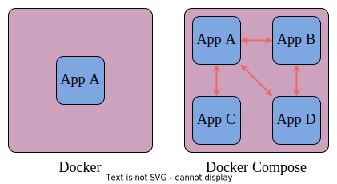

# Технологии искусственного интеллекта. Семестр 2

© Петров М.В., старший преподаватель кафедры суперкомпьютеров и общей информатики, Самарский университет

## Лекция 2. Мультиконтейнерные приложения. Docker Compose

### Содержание

1. [Введение](#21-введение)
2. [Сети в Docker](#22-сети-в-docker)
3. [YAML](#23-yaml)
4. [Файл Docker Compose](#24-файл-docker-compose)

### 2.1 Введение

Источники:
 - [YAML за 5 минут: синтаксис и основные возможности](https://tproger.ru/translations/yaml-za-5-minut-sintaksis-i-osnovnye-vozmozhnosti)
 - [Networking overview @ Docker](https://docs.docker.com/engine/network/)
 - [Networking in Compose @ Docker](https://docs.docker.com/compose/how-tos/networking/)
 - [Docker и сети @ Хабр](https://habr.com/ru/companies/otus/articles/730798/)
 - [Как работает сеть в контейнерах: Docker Bridge с нуля @ Хабр](https://habr.com/ru/articles/790212/)
 - [Изучение построения сетей Docker](http://onreader.mdl.ru/LearningDockerNetworking/content/index.html) &ndash; перевод, видимо, этой книги: [Learning Docker Networking](https://www.amazon.com/Learning-Docker-Networking-Rajdeep-Dua/dp/1785280953)
 - [Создаём виртуальную сеть, как это делает Docker @ Хабр](https://habr.com/ru/articles/794262/) &ndash; немного про сети
 - [Compose file reference @ Docker](https://docs.docker.com/reference/compose-file/)
 - [Docker Compose Quickstart](https://docs.docker.com/compose/gettingstarted/)

[Docker Compose](https://docs.docker.com/compose/) &ndash; это инструмент для декларативного описания и запуска приложений, состоящих из нескольких контейнеров. Он использует `yaml` файл для настройки сервисов приложения и выполняет процесс создания и запуска всех контейнеров с помощью одной команды. Утилита `docker-compose` позволяет выполнять команды на нескольких контейнерах одновременно &ndash; создавать образы, масштабировать контейнеры, запускать остановленные контейнеры и др.

Одиночные контейнеры хорошо подходят для развертывания простейших приложений, работающих автономно, не зависящих, например, от внешних источников данных или от неких сервисов. На практике же подобные приложения &ndash; редкость. Реальные проекты обычно включают в себя целый набор совместно работающих приложений.  

Как узнать, нужно ли вам, при развёртывании некоего проекта, воспользоваться **Docker Compose**? На самом деле &ndash; очень просто. Если для обеспечения функционирования этого проекта используется несколько сервисов, то **Docker Compose** может вам пригодиться. Например, в ситуации, когда создают веб-сайт, которому, для выполнения аутентификации пользователей, нужно подключиться к базе данных. Подобный проект может состоять из двух сервисов &ndash; того, что обеспечивает работу сайта, и того, который отвечает за поддержку базы данных.

Технология **Docker Compose**, если описывать её упрощённо, позволяет, с помощью одной команды, запускать множество сервисов.

#### Разница между Docker и Docker Compose

Docker применяется для управления отдельными контейнерами (сервисами), из которых состоит приложение.

Docker Compose используется для одновременного управления несколькими контейнерами, входящими в состав приложения. Этот инструмент предлагает те же возможности, что и Docker, но позволяет работать с более сложными приложениями.

<div align="center">
  
  <p style="text-align: center">
    Рисунок 1 &ndash; Docker vs Docker Compose
  </p>
</div>

Для организации взаимодействия между контейнерами приложения используются [сетевые компоненты](https://docs.docker.com/engine/network/).

### 2.2 Сети в Docker

Сети в Docker позволяют контейнерам взаимодействовать между собой, а также обмениваться данными с внешними сетевыми интерфейсами.

#### Сетевые драйверы в Docker

Для того чтобы работать с сетью, Docker необходимы драйверы. Имеется несколько драйверов по умолчанию, которые обеспечивают основной функционал по работе с сетью:
- `none`: полная изоляция контейнера от всех сетевых ресурсов (как от сетевых интерфейсов хоста, так и от других контейнеров).
- `bridge`: сетевой драйвер по умолчанию. По сути это мост между контейнером и хостом. Мостовые сети обычно используются, когда приложения выполняются в автономных контейнерах, которые должны взаимодействовать друг с другом. Контейнер в данном случае изолирован от внешней сети. Для доступа нужно прокидывать порты.
- `host`: для автономных контейнеров устраняется сетевая изолированность между контейнером и хостом и напрямую используются сетевые ресурсы хоста. Это значит, что контейнер может общаться с сервисами, которые запущены на локальном интерфейсе так, как если бы он был запущен прямо на хосте.
- `overlay`: наложенные сети соединяют несколько демонов Docker.
- `macvlan`: сети Macvlan позволяют присваивать контейнеру MAC-адрес, благодаря чему он выглядит как физическое устройство в сети (создается виртуальный сетевой интерфейс, который подключается к физическому).
- `ipvlan`: такие сети предоставляют полный контроль над IPv4 и IPv6 адресацией.

Более подробно в [Как работает сеть в контейнерах: Docker Bridge с нуля @ Хабр](https://habr.com/ru/articles/790212/) (перевод) или [How Container Networking Works: a Docker Bridge Network From Scratch](https://labs.iximiuz.com/tutorials/container-networking-from-scratch) (оригинал).

#### Некоторые команды

Список доступных команд:

```bash
docker network --help
```

Результат выполнения:

```bash
$ docker network --help

Usage:  docker network COMMAND

Manage networks

Commands:
  connect     Connect a container to a network
  create      Create a network
  disconnect  Disconnect a container from a network
  inspect     Display detailed information on one or more networks
  ls          List networks
  prune       Remove all unused networks
  rm          Remove one or more networks

Run 'docker network COMMAND --help' for more information on a command.
```

Для начала посмотрим, какие именно настройки сети у нас имеются. Сделать это можно с помощью следующей команды:

```bash
docker network ls
```

Результат выполнения:

```bash
$ docker network ls
NETWORK ID     NAME              DRIVER    SCOPE
8797e375cb8e   bridge            bridge    local
20c6e1718480   cnn               bridge    local
d0aaab082f73   docker_default    bridge    local
f4e5f5ad9ca2   docker_hsis_net   bridge    local
fe45341a4ef5   host              host      local
9bb29d41617e   none              null      local
```

Здесь `bridge`, `host`, `none` (столбец `NAME`) &ndash; сети по умолчанию. Как видно, Docker назначает сетям идентификаторы по аналогии с идентификаторами для контейнеров.  

Если мы хотим посмотреть более подробную информацию о той или иной сети, мы можем прибегнуть к помощи следующей команды:

```bash
docker network inspect
```

Справка:

```bash
$ docker network inspect --help

Usage:  docker network inspect [OPTIONS] NETWORK [NETWORK...]

Display detailed information on one or more networks

Options:
  -f, --format string   Format output using a custom template:
                        'json':             Print in JSON format
                        'TEMPLATE':         Print output using the given Go template.
                        Refer to https://docs.docker.com/go/formatting/ for more information about formatting output with templates
  -v, --verbose         Verbose output for diagnostics
```

Пример:

```bash
$ docker network inspect bridge
[
    {
        "Name": "bridge",
        "Id": "8797e375cb8efbc04bce965cebf743724c39a41b616f93a4243760e98bdebd45",
        "Created": "2024-10-11T16:11:31.069329273+04:00",
        "Scope": "local",
        "Driver": "bridge",
        "EnableIPv6": false,
        "IPAM": {
            "Driver": "default",
            "Options": null,
            "Config": [
                {
                    "Subnet": "172.17.0.0/16",
                    "Gateway": "172.17.0.1"
                }
            ]
        },
        "Internal": false,
        "Attachable": false,
        "Ingress": false,
        "ConfigFrom": {
            "Network": ""
        },
        "ConfigOnly": false,
        "Containers": {},
        "Options": {
            "com.docker.network.bridge.default_bridge": "true",
            "com.docker.network.bridge.enable_icc": "true",
            "com.docker.network.bridge.enable_ip_masquerade": "true",
            "com.docker.network.bridge.host_binding_ipv4": "0.0.0.0",
            "com.docker.network.bridge.name": "docker0",
            "com.docker.network.driver.mtu": "1500"
        },
        "Labels": {}
    }
]
```

Как видно, в настройках уже указаны подсеть, шлюз по умолчанию и другие параметры.  

Пример созданной сети в результате запуска приложения Docker Compose:

```bash
$ docker network inspect docker_hsis_net
[
    {
        "Name": "docker_hsis_net",
        "Id": "f4e5f5ad9ca2aa98242315644a8510610136657e27046c909ed3d46305738d58",
        "Created": "2024-10-18T20:55:48.142854142+04:00",
        "Scope": "local",
        "Driver": "bridge",
        "EnableIPv6": false,
        "IPAM": {
            "Driver": "default",
            "Options": null,
            "Config": [
                {
                    "Subnet": "172.24.0.0/16"
                }
            ]
        },
        "Internal": false,
        "Attachable": false,
        "Ingress": false,
        "ConfigFrom": {
            "Network": ""
        },
        "ConfigOnly": false,
        "Containers": {},
        "Options": {},
        "Labels": {
            "com.docker.compose.network": "hsis_net",
            "com.docker.compose.project": "docker",
            "com.docker.compose.version": "2.29.7"
        }
    }
]
```

Рассмотрим каждый из драйверов.

#### Драйвер, которого нет: `none`

Иногда контейнер должен функционировать в полностью изолированной среде. То есть нам не требуется сетевой стек в контейнере. В таком случае при запуске контейнера необходимо использовать флаг `--network none`. Результатом работы этой команды будет создание устройства `loopback`.

> Флаг `--network none` &ndash; в классическом варианте запуска контейнера через Docker, а не Docker Compose.

#### Режим моста: `bridge`

Более интересным с практической точки зрения является использование режима моста. Мостовая сеть обеспечивает взаимодействие подключенных к ней контейнеров. Соответственно, устройство *Bridge* перенаправляет трафик между сегментами сети. При этом важной особенностью мостовой сети является то, что здесь обеспечивается изоляция от контейнеров, которые не подключены к данной мостовой сети. Тем самым мы получаем выделенную сеть, внутри которой контейнеры могут взаимодействовать между собой беспрепятственно. Однако, данные контейнеры изолированы от внешних контейнеров и хоста. Для того чтобы находиться в одной мостовой сети, контейнеры должны выполняться на одном и том же хосте демона Docker.  

> Однако, важно понимать, что сетевые параметры мостовой сети по умолчанию изменить нельзя. Запущенные контейнеры подключаются к мостовой сети `bridge` *по умолчанию, если не указано иное*. Это влечет за собой определенный риск, поскольку несвязанные стеки/сервисы/контейнеры могут начать взаимодействовать друг с другом.  

Но пользователь может создать собственный мост. Вернее, пользователь может создать множество мостов, и эти мосты, определяемые пользователем, обеспечивают автоматическое определение DNS между контейнерами. Важным аспектом использования пользовательских мостов является их лучшая, по сравнению с мостами по умолчанию, изолированность. При необходимости можно быстро подключать контейнеры к пользовательским сетям и отключать их от них. И для каждой пользовательской сети создается свой настраиваемый мост.  

В течение жизни контейнера можно в процессе работы быстро подключать и отключать его от пользовательских сетей. Чтобы убрать контейнер из мостовой сети по умолчанию, необходимо остановить контейнер и создать его заново с другими сетевыми параметрами.

#### Драйвер Хост: `host`

Еще один сетевой драйвер Docker часто используемый в работе &ndash; это `host`. При использовании данного драйвера сетевой стек контейнера не изолирован от хоста Docker, и контейнер не получает собственный выделенный IP-адрес. Такой режим работы полезен, когда контейнер содержит большое количество открытых портов, используемых в процессе работы, также, когда необходимо оптимизировать производительность. Мы можем оптимизировать производительность за счет отсутствия необходимости в использовании трансляции сетевых адресов (NAT).  

Здесь существенным недостатком использования драйвера Хост является возможность его использования только на узлах под управлением Linux. Ни под Mac, ни под Windows мы не сможем использовать данный тип драйверов.

#### Драйвер Overlay: `overlay`

Драйвер Overlay на сегодняшний день распространен гораздо меньше, чем решения, описанные ранее. Наложенная сеть Overlay &ndash; это сетевой драйвер, предназначенный для соединения нескольких демонов Docker между собой. Такие соединения широко используются для взаимодействия `docker-swarm` служб. Оверлейные сети также можно использовать для взаимодействия между автономными контейнерами на разных Docker демонах. Благодаря использованию данных драйверов у нас отпадает необходимость в маршрутизации на уровне ОС между этими контейнерами.

#### Драйвер MACvlan: `macvlan`

Сетевой драйвер, с помощью которого можно назначить MAC-адрес контейнеру, в результате чего он становится виден в сети как физическое устройство. Docker демон направляет трафик на контейнеры по их MAC-адресам. В некоторых случаях использование MACvlan позволяет работать с приложениями, которым необходимо прямое подключение к физической сети.

#### Драйвер IPvlan: `ipvlan`

Источники:
- [Сравнение производительности сетевых решений для Kubernetes @ Хабр](https://habr.com/ru/companies/flant/articles/332432/)
- [MacVLAN vs IPvlan: Understand the difference](https://ipwithease.com/macvlan-vs-ipvlan-understand-the-difference/)
- [Сетевая модель OSI @ Википедия](https://ru.wikipedia.org/wiki/%D0%A1%D0%B5%D1%82%D0%B5%D0%B2%D0%B0%D1%8F_%D0%BC%D0%BE%D0%B4%D0%B5%D0%BB%D1%8C_OSI)

IPvlan &ndash; драйвер в ядре Linux, позволяющий создавать виртуальные интерфейсы с уникальными IP-адресами без необходимости в использовании интерфейса моста. Основное отличие от MACvlan заключается в том, что IPvlan может работать в L3 режиме (уровни сетевой модели OSI).

> L2 &ndash; канальный уровень, L3 &ndash; сетевой уровень. Условно, при использовании MACvlan контейнеры разделяют один физический сетевой интерфейс, каждому контейнеру назначается свой MAC-адрес, отличный от MAC-адреса физического сетевого интерфейса. При использовании драйвера IPvlan каждому контейнеру присваивается IP-адрес, а MAC-адрес виртуального интерфейса контейнера совпадает с физическим. Наглядные схемы приведены в [MacVLAN vs IPvlan: Understand the difference](https://ipwithease.com/macvlan-vs-ipvlan-understand-the-difference/). 

### 2.3 YAML

**YAML** (***Y****AML* ***A****in't* ***M****arkup* ***L****anguage*) &ndash; это язык для сериализации данных, который отличается простым синтаксисом и позволяет хранить сложноорганизованные данные в компактном и читаемом формате.  

[YAML](https://yaml.org/) &ndash; это язык для хранения информации в формате, понятном человеку. Его название расшифровывается как, "Ещё один язык разметки". Однако, позже расшифровку изменили на "YAML не язык разметки", чтобы отличать его от настоящих языков разметки. Язык похож на XML и JSON, но использует более минималистичный синтаксис при сохранении аналогичных возможностей. YAML обычно применяют для создания конфигурационных файлов в программах типа [Инфраструктура как код](https://ru.wikipedia.org/wiki/%D0%98%D0%BD%D1%84%D1%80%D0%B0%D1%81%D1%82%D1%80%D1%83%D0%BA%D1%82%D1%83%D1%80%D0%B0_%D0%BA%D0%B0%D0%BA_%D0%BA%D0%BE%D0%B4) (Iac), или для управления контейнерами в работе DevOps.  

Особенности YAML:
- понятный человеку код
- минималистичный синтаксис
- заточен под работу с данными
- встроенный стиль, похожий на JSON (YAML является его надмножеством)
- поддерживает комментарии
- поддерживает строки без кавычек
- считается "чище", чем JSON
- дополнительные возможности (расширяемые типы данных, относительные якоря и маппинг типов с сохранением порядка ключей).

#### Пример

```yaml
---
mdg:
  version: some version
  timestamp_date_format: yyyyMMdd
  timestamp_time_format: hhmmsszzz
  mdg_subdir_name_prefix: mdg_
  capture_start_timer_interval_ms: 0 # unused
  # Seconds
  camera_settings_sync_timer_interval: 5
  capturing_shutdown_timer_interval: 5
  # Grabbers to enable
  enable_tis_camera_grabber: yes
tiscg:
  # RadxaZero, RaspberryPi, JetsonNano, Rock3A, RockCM3: 0, 1, 2, 3, 4
  platform: 4
  # GRAY8, BGRx
  pixel_format: GRAY8
  # DFM 42BUC03-ML: 640x480, 1024x768, 1280x960
  # DMM 37UX252-ML: 640x480, 1024x768, 1920x1080, 2048x1536
  frame_width: 1920 # for caps usage only
  frame_height: 1080 # for caps usage only
  # ...
  captured_data_settings:
    frames:
      captured_data_format: jpg
      captured_data_prefix: tis_frame_
    video:
      captured_data_format: mkv
      captured_data_prefix: tis_video
    video_with_frames:
      captured_data_frames_format: jpg
      captured_data_frames_prefix: tis_frame_
      captured_data_video_format: mkv
      captured_data_video_prefix: tis_video
      frame_num: 3
```

Считывание конфига в Python с использованием [PyYAML](https://pypi.org/project/PyYAML/):

```python
def load_settings(self):
    loading_is_ok = True

    try:
        self.config = yaml.safe_load(open(self.config_path))
    except yaml.YAMLError as e:
        loading_is_ok = False
        print(f"Config loading error: {e}")

    if loading_is_ok:
        self.config_mdg = self.config["mdg"]
        self.config_tiscg = self.config["tiscg"]
        self.timestamp_date_format = self.config_mdg["timestamp_date_format"]
        self.timestamp_time_format = self.config_mdg["timestamp_time_format"]
        self.capture_start_timer_interval_ms = self.config_mdg["capture_start_timer_interval_ms"]
        self.camera_settings_sync_timer_interval = self.config_mdg["camera_settings_sync_timer_interval"]
        self.capturing_shutdown_timer_interval = self.config_mdg["capturing_shutdown_timer_interval"]
        self.enable_tis_camera_grabber = self.config_mdg["enable_tis_camera_grabber"]
    
    return loading_is_ok
```

Подробнее про синтаксис: [YAML за 5 минут: синтаксис и основные возможности](https://tproger.ru/translations/yaml-za-5-minut-sintaksis-i-osnovnye-vozmozhnosti).

### 2.4 Файл Docker Compose

Спецификации файла Docker Compose описаны в разделе [Compose file reference](https://docs.docker.com/reference/compose-file/).