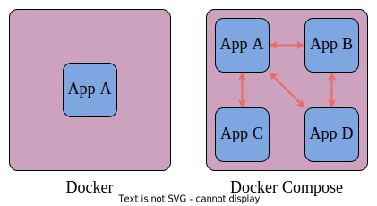

# Технологии искусственного интеллекта. Семестр 2

© Петров М.В., старший преподаватель кафедры киберфотоники, Самарский университет

## Лекция 3. Мультиконтейнерные приложения. Docker Compose

### Содержание

1. [Введение](#31-введение)
2. [Сети в Docker](#32-сети-в-docker)
3. [YAML](#33-yaml)
4. [Файл Docker Compose](#34-файл-docker-compose)

### 3.1 Введение

Источники:
 - [YAML за 5 минут: синтаксис и основные возможности](https://tproger.ru/translations/yaml-za-5-minut-sintaksis-i-osnovnye-vozmozhnosti)
 - [Networking overview @ Docker](https://docs.docker.com/engine/network/)
 - [Networking in Compose @ Docker](https://docs.docker.com/compose/how-tos/networking/)
 - [Docker и сети @ Хабр](https://habr.com/ru/companies/otus/articles/730798/)
 - [Как работает сеть в контейнерах: Docker Bridge с нуля @ Хабр](https://habr.com/ru/articles/790212/)
 - [Изучение построения сетей Docker](http://onreader.mdl.ru/LearningDockerNetworking/content/index.html) &ndash; перевод, видимо, этой книги: [Learning Docker Networking](https://www.amazon.com/Learning-Docker-Networking-Rajdeep-Dua/dp/1785280953)
 - [Создаём виртуальную сеть, как это делает Docker @ Хабр](https://habr.com/ru/articles/794262/) &ndash; немного про сети
 - [Compose file reference @ Docker](https://docs.docker.com/reference/compose-file/)
 - [Docker Compose Quickstart](https://docs.docker.com/compose/gettingstarted/)

[Docker Compose](https://docs.docker.com/compose/) &ndash; это инструмент для декларативного описания и запуска приложений, состоящих из нескольких контейнеров. Он использует `yaml` файл для настройки сервисов приложения и выполняет процесс создания и запуска всех контейнеров с использованием одной команды. Утилита `docker-compose` позволяет выполнять команды на нескольких контейнерах одновременно: создавать образы, масштабировать контейнеры, запускать остановленные контейнеры и т.п.

Одиночные контейнеры хорошо подходят для развертывания простейших приложений, работающих автономно, не зависящих, например, от внешних источников данных или от неких сервисов. На практике же подобные приложения &ndash; редкость. Реальные проекты обычно включают в себя целый набор совместно работающих приложений. Если для обеспечения функционирования проекта используется несколько сервисов, то имеет смысл воспользоваться **Docker Compose**. Простейший пример &ndash; веб-приложение, в котором для выполнения аутентификации пользователей необходимо осуществить подключение к базе данных. Подобный проект может состоять из двух сервисов:
- основной сервис, реализующий функционал веб-приложения (фронтенд и бэкенд);
- отдельный сервис, отвечающий за взаимодействие с базой данных.

Технология **Docker Compose**, если описывать её упрощённо, позволяет с использованием одной команды запускать множество сервисов.

#### Разница между Docker и Docker Compose

Docker применяется для управления отдельными контейнерами (сервисами), из которых состоит приложение.

Docker Compose используется для одновременного управления несколькими контейнерами, входящими в состав приложения. Этот инструмент предлагает те же возможности, что и Docker, но позволяет работать с более сложными приложениями.

<div align="center">
  
  <p style="text-align: center">
    Рисунок 1 &ndash; Docker vs Docker Compose
  </p>
</div>

Для организации взаимодействия между контейнерами приложения используются [сетевые компоненты](https://docs.docker.com/engine/network/).

### 3.2 Сети в Docker

Сети в Docker позволяют контейнерам взаимодействовать между собой, а также обмениваться данными с внешними сетевыми интерфейсами.

#### Сетевые драйверы в Docker

Для того чтобы работать с сетью, Docker необходимы драйверы. Имеется несколько драйверов по умолчанию, которые обеспечивают основной функционал по работе с сетью:
- `none`: полная изоляция контейнера от всех сетевых ресурсов (как от сетевых интерфейсов хоста, так и от других контейнеров).
- `bridge`: сетевой драйвер по умолчанию. По сути это мост между контейнером и хостом. Мостовые сети обычно используются, когда приложения выполняются в автономных контейнерах, которые должны взаимодействовать друг с другом. Контейнер в данном случае изолирован от внешней сети. Для доступа нужно пробрасывать порты.
- `host`: для автономных контейнеров устраняется сетевая изолированность между контейнером и хостом и напрямую используются сетевые ресурсы хоста. Это значит, что контейнер может общаться с сервисами, которые запущены на локальном интерфейсе так, как если бы он был запущен прямо на хосте.
- `overlay`: наложенные сети соединяют несколько демонов Docker.
- `macvlan`: сети Macvlan позволяют присваивать контейнеру MAC-адрес, благодаря чему он выглядит как физическое устройство в сети (создается виртуальный сетевой интерфейс, который подключается к физическому).
- `ipvlan`: такие сети предоставляют полный контроль над IPv4 и IPv6 адресацией.

Более подробно в [Как работает сеть в контейнерах: Docker Bridge с нуля @ Хабр](https://habr.com/ru/articles/790212/) (перевод) или [How Container Networking Works: a Docker Bridge Network From Scratch](https://labs.iximiuz.com/tutorials/container-networking-from-scratch) (оригинал).

#### Некоторые команды

Список доступных команд:

```bash
docker network --help
```

Результат выполнения:

```bash
$ docker network --help

Usage:  docker network COMMAND

Manage networks

Commands:
  connect     Connect a container to a network
  create      Create a network
  disconnect  Disconnect a container from a network
  inspect     Display detailed information on one or more networks
  ls          List networks
  prune       Remove all unused networks
  rm          Remove one or more networks

Run 'docker network COMMAND --help' for more information on a command.
```

Для начала посмотрим, какие именно настройки сети у нас имеются. Сделать это можно с использованием следующей команды:

```bash
docker network ls
```

Результат выполнения:

```bash
$ docker network ls
NETWORK ID     NAME              DRIVER    SCOPE
8797e375cb8e   bridge            bridge    local
20c6e1718480   cnn               bridge    local
d0aaab082f73   docker_default    bridge    local
f4e5f5ad9ca2   docker_hsis_net   bridge    local
fe45341a4ef5   host              host      local
9bb29d41617e   none              null      local
```

Здесь `bridge`, `host`, `none` (столбец `NAME`) &ndash; сети по умолчанию. Как видно, Docker назначает сетям идентификаторы по аналогии с идентификаторами для контейнеров.  

Если мы хотим посмотреть более подробную информацию о той или иной сети, мы можем использовать следующую команду:

```bash
docker network inspect
```

Справка:

```bash
$ docker network inspect --help

Usage:  docker network inspect [OPTIONS] NETWORK [NETWORK...]

Display detailed information on one or more networks

Options:
  -f, --format string   Format output using a custom template:
                        'json':             Print in JSON format
                        'TEMPLATE':         Print output using the given Go template.
                        Refer to https://docs.docker.com/go/formatting/ for more information about formatting output with templates
  -v, --verbose         Verbose output for diagnostics
```

Пример:

```bash
$ docker network inspect bridge
[
    {
        "Name": "bridge",
        "Id": "8797e375cb8efbc04bce965cebf743724c39a41b616f93a4243760e98bdebd45",
        "Created": "2024-10-11T16:11:31.069329273+04:00",
        "Scope": "local",
        "Driver": "bridge",
        "EnableIPv6": false,
        "IPAM": {
            "Driver": "default",
            "Options": null,
            "Config": [
                {
                    "Subnet": "172.17.0.0/16",
                    "Gateway": "172.17.0.1"
                }
            ]
        },
        "Internal": false,
        "Attachable": false,
        "Ingress": false,
        "ConfigFrom": {
            "Network": ""
        },
        "ConfigOnly": false,
        "Containers": {},
        "Options": {
            "com.docker.network.bridge.default_bridge": "true",
            "com.docker.network.bridge.enable_icc": "true",
            "com.docker.network.bridge.enable_ip_masquerade": "true",
            "com.docker.network.bridge.host_binding_ipv4": "0.0.0.0",
            "com.docker.network.bridge.name": "docker0",
            "com.docker.network.driver.mtu": "1500"
        },
        "Labels": {}
    }
]
```

Как видно, в настройках уже указаны подсеть, шлюз по умолчанию и другие параметры.  

Пример созданной сети в результате запуска приложения Docker Compose:

```bash
$ docker network inspect docker_hsis_net
[
    {
        "Name": "docker_hsis_net",
        "Id": "f4e5f5ad9ca2aa98242315644a8510610136657e27046c909ed3d46305738d58",
        "Created": "2024-10-18T20:55:48.142854142+04:00",
        "Scope": "local",
        "Driver": "bridge",
        "EnableIPv6": false,
        "IPAM": {
            "Driver": "default",
            "Options": null,
            "Config": [
                {
                    "Subnet": "172.24.0.0/16"
                }
            ]
        },
        "Internal": false,
        "Attachable": false,
        "Ingress": false,
        "ConfigFrom": {
            "Network": ""
        },
        "ConfigOnly": false,
        "Containers": {},
        "Options": {},
        "Labels": {
            "com.docker.compose.network": "hsis_net",
            "com.docker.compose.project": "docker",
            "com.docker.compose.version": "2.29.7"
        }
    }
]
```

Рассмотрим каждый из драйверов.

#### Драйвер, которого нет: `none`

Иногда контейнер должен функционировать в полностью изолированной среде. То есть нам не требуется сетевой стек в контейнере. В таком случае при запуске контейнера необходимо использовать флаг `--network none`. Результатом работы этой команды будет создание устройства `loopback`.

> Флаг `--network none` &ndash; в классическом варианте запуска контейнера через Docker, а не Docker Compose.

#### Режим моста: `bridge`

Более интересным с практической точки зрения является использование режима моста. Мостовая сеть (сетевой мост, сеть-мост, "бридж") обеспечивает взаимодействие подключенных к ней контейнеров. Соответственно, устройство `Bridge` перенаправляет трафик между сегментами сети. При этом важной особенностью мостовой сети является то, что здесь обеспечивается изоляция от контейнеров, которые не подключены к данной мостовой сети. Тем самым мы получаем выделенную сеть, внутри которой контейнеры могут взаимодействовать между собой беспрепятственно. Однако, данные контейнеры изолированы от внешних контейнеров и хоста. Для того чтобы находиться в одной мостовой сети, контейнеры должны выполняться на одном и том же хосте демона Docker.  

> Однако, важно понимать, что сетевые параметры мостовой сети по умолчанию изменить нельзя. Запущенные контейнеры подключаются к мостовой сети `bridge` *по умолчанию, если не указано иное*. Это влечет за собой определенный риск, поскольку несвязанные стеки/сервисы/контейнеры могут начать взаимодействовать друг с другом.  

Но пользователь может создать собственный мост. Вернее, пользователь может создать множество мостов, и эти мосты, определяемые пользователем, обеспечивают автоматическое определение DNS между контейнерами. Важным аспектом использования пользовательских мостов является их лучшая, по сравнению с мостами по умолчанию, изолированность. При необходимости можно быстро подключать контейнеры к пользовательским сетям и отключать их от них. И для каждой пользовательской сети создается свой настраиваемый мост.  

В течение жизни контейнера можно в процессе работы быстро подключать и отключать его от пользовательских сетей. Чтобы убрать контейнер из мостовой сети по умолчанию, необходимо остановить контейнер и создать его заново с другими сетевыми параметрами.

#### Драйвер Хост: `host`

Еще один сетевой драйвер Docker часто используемый в работе &ndash; это `host`. При использовании данного драйвера сетевой стек контейнера не изолирован от хоста Docker, и контейнер не получает собственный выделенный IP-адрес. Такой режим работы полезен, когда контейнер содержит большое количество открытых портов, используемых в процессе работы, также, когда необходимо оптимизировать производительность. Мы можем оптимизировать производительность за счет отсутствия необходимости в использовании трансляции сетевых адресов (NAT).  

> Существенным недостатком использования драйвера Хост является возможность его использования только на узлах под управлением Linux. Ни под Mac, ни под Windows мы не сможем использовать данный тип драйверов.

#### Драйвер Overlay: `overlay`

Драйвер `Overlay` на сегодняшний день распространен гораздо меньше, чем решения, описанные ранее. Наложенная сеть Overlay &ndash; это сетевой драйвер, предназначенный для соединения нескольких демонов Docker между собой. Такие соединения широко используются для взаимодействия `docker-swarm` служб. Оверлейные сети также можно использовать для взаимодействия между автономными контейнерами на разных Docker демонах. Благодаря использованию данных драйверов у нас отпадает необходимость в маршрутизации на уровне ОС между этими контейнерами.

> Режим Swarm &ndash; это функция Docker, которая предоставляет встроенные возможности оркестрации контейнеров, включая собственную кластеризацию узлов Docker и планирование рабочих нагрузок контейнеров. Группа узлов Docker формирует кластер `swarm`, когда их подсистемы Docker работают вместе в режиме `swarm`. Подробнее:
> - [Swarm mode @ Docker](https://docs.docker.com/engine/swarm/)
> - [Docker Swarm для самых маленьких @ Хабр](https://habr.com/ru/articles/659813/)

#### Драйвер MACvlan: `macvlan`

Сетевой драйвер, с помощью которого можно назначить MAC-адрес контейнеру, в результате чего он становится виден в сети как физическое устройство. Docker демон направляет трафик на контейнеры по их MAC-адресам. В некоторых случаях использование `MACvlan` позволяет работать с приложениями, которым необходимо прямое подключение к физической сети.

#### Драйвер IPvlan: `ipvlan`

Источники:
- [Сравнение производительности сетевых решений для Kubernetes @ Хабр](https://habr.com/ru/companies/flant/articles/332432/)
- [MacVLAN vs IPvlan: Understand the difference](https://ipwithease.com/macvlan-vs-ipvlan-understand-the-difference/)
- [Сетевая модель OSI @ Википедия](https://ru.wikipedia.org/wiki/%D0%A1%D0%B5%D1%82%D0%B5%D0%B2%D0%B0%D1%8F_%D0%BC%D0%BE%D0%B4%D0%B5%D0%BB%D1%8C_OSI)

`IPvlan` &ndash; драйвер в ядре Linux, позволяющий создавать виртуальные интерфейсы с уникальными IP-адресами без необходимости в использовании интерфейса моста. Основное отличие от `MACvlan` заключается в том, что `IPvlan` может работать в L3 режиме (уровни сетевой модели OSI).

> L2 &ndash; канальный уровень, L3 &ndash; сетевой уровень. Условно, при использовании `MACvlan` контейнеры разделяют один физический сетевой интерфейс, каждому контейнеру назначается свой MAC-адрес, отличный от MAC-адреса физического сетевого интерфейса. При использовании драйвера `IPvlan` каждому контейнеру присваивается IP-адрес, а MAC-адрес виртуального интерфейса контейнера совпадает с физическим. Наглядные схемы приведены в [MacVLAN vs IPvlan: Understand the difference](https://ipwithease.com/macvlan-vs-ipvlan-understand-the-difference/). 

### 3.3 YAML

**YAML** (***Y****AML* ***A****in't* ***M****arkup* ***L****anguage*) &ndash; это язык для сериализации данных, который отличается простым синтаксисом и позволяет хранить сложноорганизованные данные в компактном и читаемом формате.  

[YAML](https://yaml.org/) &ndash; это язык для хранения информации в формате, понятном человеку. Его название расшифровывается как "Ещё один язык разметки". Однако, позже расшифровку изменили на "YAML не язык разметки", чтобы отличать его от настоящих языков разметки. Язык похож на XML и JSON, но использует более минималистичный синтаксис при сохранении аналогичных возможностей. YAML обычно применяют для создания конфигурационных файлов в программах типа [Инфраструктура как код](https://ru.wikipedia.org/wiki/%D0%98%D0%BD%D1%84%D1%80%D0%B0%D1%81%D1%82%D1%80%D1%83%D0%BA%D1%82%D1%83%D1%80%D0%B0_%D0%BA%D0%B0%D0%BA_%D0%BA%D0%BE%D0%B4) (Iac), или для управления контейнерами в работе DevOps.  

Особенности YAML:
- понятный человеку код
- минималистичный синтаксис
- заточен под работу с данными
- встроенный стиль, похожий на JSON (YAML является его надмножеством)
- поддерживает комментарии
- поддерживает строки без кавычек
- считается "чище", чем JSON
- дополнительные возможности (расширяемые типы данных, относительные якоря и маппинг типов с сохранением порядка ключей).

#### Пример

```yaml
---
mdg:
  version: some version
  timestamp_date_format: yyyyMMdd
  timestamp_time_format: hhmmsszzz
  mdg_subdir_name_prefix: mdg_
  capture_start_timer_interval_ms: 0 # unused
  # Seconds
  camera_settings_sync_timer_interval: 5
  capturing_shutdown_timer_interval: 5
  # Grabbers to enable
  enable_tis_camera_grabber: yes
tiscg:
  # RadxaZero, RaspberryPi, JetsonNano, Rock3A, RockCM3: 0, 1, 2, 3, 4
  platform: 4
  # GRAY8, BGRx
  pixel_format: GRAY8
  # DFM 42BUC03-ML: 640x480, 1024x768, 1280x960
  # DMM 37UX252-ML: 640x480, 1024x768, 1920x1080, 2048x1536
  frame_width: 1920 # for caps usage only
  frame_height: 1080 # for caps usage only
  # ...
  captured_data_settings:
    frames:
      captured_data_format: jpg
      captured_data_prefix: tis_frame_
    video:
      captured_data_format: mkv
      captured_data_prefix: tis_video
    video_with_frames:
      captured_data_frames_format: jpg
      captured_data_frames_prefix: tis_frame_
      captured_data_video_format: mkv
      captured_data_video_prefix: tis_video
      frame_num: 3
```

Пример считывания конфига в Python с использованием [PyYAML](https://pypi.org/project/PyYAML/):

```python
import yaml
...
    def load_settings(self):
        loading_is_ok = True
    
        try:
            self.config = yaml.safe_load(open(self.config_path))
        except yaml.YAMLError as e:
            loading_is_ok = False
            print(f"Config loading error: {e}")
    
        if loading_is_ok:
            self.config_mdg = self.config["mdg"]
            self.config_tiscg = self.config["tiscg"]
            self.timestamp_date_format = self.config_mdg["timestamp_date_format"]
            self.timestamp_time_format = self.config_mdg["timestamp_time_format"]
            self.capture_start_timer_interval_ms = self.config_mdg["capture_start_timer_interval_ms"]
            self.camera_settings_sync_timer_interval = self.config_mdg["camera_settings_sync_timer_interval"]
            self.capturing_shutdown_timer_interval = self.config_mdg["capturing_shutdown_timer_interval"]
            self.enable_tis_camera_grabber = self.config_mdg["enable_tis_camera_grabber"]
        
        return loading_is_ok
```

Подробнее про синтаксис: [YAML за 5 минут: синтаксис и основные возможности](https://tproger.ru/translations/yaml-za-5-minut-sintaksis-i-osnovnye-vozmozhnosti).

### 3.4 Файл Docker Compose

Спецификации файла Docker Compose описаны в разделе [Compose file reference @ Docker](https://docs.docker.com/reference/compose-file/). Минимальный воспроизводимый туториал по Docker Compose для понимания процесса описан в [Docker Compose Quickstart @ Docker](https://docs.docker.com/compose/gettingstarted/). Параметров в конфиге много, поэтому рассмотрим рабочий пример.

Пример [конфига](data/hsi_storage_compose.yml):

```yaml
version: "3"
services:
  minio_server:
    container_name: hsis_minio
    image: quay.io/minio/minio
    environment:
      MINIO_ROOT_USER: $MINIO_ADMIN_USER
      MINIO_ROOT_PASSWORD: $MINIO_ADMIN_PASSWORD
      MINIO_DEFAULT_BUCKETS: $MINIO_BUCKET_NAME
    volumes:
      - $MINIO_REMOTE_VOL:$MINIO_LOCAL_VOL
    command: server $MINIO_LOCAL_VOL --console-address :$MINIO_SRV_CONSOLE_LOCAL_PORT
    networks:
      hsis_net:
        ipv4_address: $DOCKER_MINIO_IP
    ports:
      - $MINIO_SRV_CONSOLE_REMOTE_PORT:$MINIO_SRV_CONSOLE_LOCAL_PORT
      - $MINIO_SRV_API_REMOTE_PORT:$MINIO_SRV_API_LOCAL_PORT
  db:
    container_name: hsis_db
    image: postgres:15-bullseye
    environment:
      PGDATA: $PG_DATA
      POSTGRES_PASSWORD: $PG_PASSWORD
      POSTGRES_DB: $PG_DB_NAME
    volumes:
      - $PG_REMOTE_VOL:$PG_LOCAL_VOL
    networks:
      hsis_net:
        ipv4_address: $DOCKER_DB_IP
    ports:
      - $PG_REMOTE_PORT:$PG_LOCAL_PORT
    depends_on:
      - minio_server
  pgadmin:
    container_name: hsis_db_web
    image: dpage/pgadmin4:7.7
    environment:
      PGADMIN_DEFAULT_EMAIL: $PGA_EMAIL
      PGADMIN_DEFAULT_PASSWORD: $PGA_PASSWORD
    volumes:
      - $PGA_REMOTE_VOL:$PGA_LOCAL_VOL
    networks:
      hsis_net:
        ipv4_address: $DOCKER_DB_WEB_IP
    ports:
      - $PGA_WEB_REMOTE_PORT:$PGA_WEB_LOCAL_PORT
    depends_on:
      - minio_server
      - db
  web:
    container_name: hsis_web
    build:
      context: ..
      dockerfile: docker/hsi_storage_web.dockerfile
    devices:
      - /dev/nvidia0:/dev/nvidia0
      - /dev/nvidiactl:/dev/nvidiactl
      - /dev/nvidia-caps:/dev/nvidia-caps
      - /dev/nvidia-modeset:/dev/nvidia-modeset
      - /dev/nvidia-uvm:/dev/nvidia-uvm
      - /dev/nvidia-uvm-tools:/dev/nvidia-uvm-tools
    deploy:
      resources:
        reservations:
          devices:
            - driver: nvidia
              count: 1
              capabilities: [ gpu ]
    environment:
      MODULE_NAME: hsis_server.__init__
#      VARIABLE_NAME: create_app()
      VARIABLE_NAME: app
#      LOG_LEVEL: "debug"
#      WORKERS_PER_CORE: 0.5
      TIMEOUT: 1200
      GRACEFUL_TIMEOUT: 1200
    networks:
      hsis_net:
        ipv4_address: $DOCKER_WEB_IP
    ports:
      - $DB_WEB_REMOTE_PORT:$DB_WEB_LOCAL_PORT
    depends_on:
      - minio_server
      - db
networks:
  hsis_net:
    ipam:
      driver: default
      config:
        - subnet: $DOCKER_NETWORK
```

Рассмотрим по отдельности различные блоки данного конфига. Согласно *Compose file reference* [в самом начале конфига](https://docs.docker.com/reference/compose-file/version-and-name/) идет название проекта (опционально) и раздел сервисы:

```yaml
version: "3"
services:
  minio_server:
# ...
```

Параметр `version` используется для обратной совместимости, носит чисто информативный характер:

> Legacy versions 2.x and 3.x of the Compose file format were merged into the Compose Specification. It is implemented in versions 1.27.0 and above (also known as Compose V2) of the Docker Compose CLI.

Далее объявляется раздел сервисов `services`. 1 сервис == 1 контейнер. Сервисом может быть клиент, сервер, сервер баз данных и т.п. В нашем случае имеется 4 сервиса:
- `minio_server` &ndash; сервер объектного хранилища [MinIO](https://min.io/)
- `db` &ndash; БД [PostgreSQL](https://www.postgresql.org/)
- `pgadmin` &ndash; [pgAdmin]() &ndash; платформа для администрирования и настройки СУБД PostgreSQL
- `web` &ndash; веб-сайт, реализация на Python с использованием [FastAPI](https://fastapi.tiangolo.com/), [Jinja2](https://jinja.palletsprojects.com/en/stable/), [Bootstrap](https://getbootstrap.com/) и немного JS.

Рассмотрим сервисы и задаваемые атрибуты по порядку. Полный список различных атрибутов приведен в [Services top-level elements @ Docker](https://docs.docker.com/reference/compose-file/services/).  

`minio_server`:

```yaml
services:
  minio_server:
    container_name: hsis_minio
    image: quay.io/minio/minio
    environment:
      MINIO_ROOT_USER: $MINIO_ADMIN_USER
      MINIO_ROOT_PASSWORD: $MINIO_ADMIN_PASSWORD
      MINIO_DEFAULT_BUCKETS: $MINIO_BUCKET_NAME
    volumes:
      - $MINIO_REMOTE_VOL:$MINIO_LOCAL_VOL
    command: server $MINIO_LOCAL_VOL --console-address :$MINIO_SRV_CONSOLE_LOCAL_PORT
    networks:
      hsis_net:
        ipv4_address: $DOCKER_MINIO_IP
    ports:
      - $MINIO_SRV_CONSOLE_REMOTE_PORT:$MINIO_SRV_CONSOLE_LOCAL_PORT
      - $MINIO_SRV_API_REMOTE_PORT:$MINIO_SRV_API_LOCAL_PORT
# ...
```

Здесь:
- `container_name` &ndash; имя контейнера. Аналогично тегу при создании контейнера без compose.
- `image` &ndash; имя образа. Аналогично команде `FROM` из докер-файла. Используется образ из репозитория [Quay.io](https://quay.io/).
- `environment` &ndash; раздел с переменными среды (environment vars), которые используются в образе или докер-файле.
   > Здесь `$MINIO_ADMIN_USER` &ndash; и т.п. переменные устанавливаются извне в соответствующем bash-скрипте перед сборкой приложения (будет рассмотрено далее).
- `volumes` &ndash; раздел, в котором построчно указывается проброс необходимых директорий с хоста в контейнер.
- `command` &ndash; [command](https://docs.docker.com/reference/compose-file/services/#command) переопределяет команду после старта контейнера, которая задана в образе или в команде `CMD` докер-файла.
- `networks` &ndash; в данном разделе перечисляются сети, к которым подключается данный контейнер. `hsis_net` &ndash; название сети (раздел `networks` после раздела сервисов). Здесь в сети `hsis_net` атрибут `ipv4_address` задает статический IP-адрес контейнеру.
  - `ports` &ndash; в данном разделе пробрасываются порты между хостом и контейнером в виде `порт хоста` &rlarr; `порт внутри контейнера`. Проброс портов нужен, чтобы с хоста осуществить подключение к сервису ***внутри контейнера*** (по аналогии с пробросом портов в лекции про SSH).

Следующий сервис `db`:

```yaml
# ...
  db:
    container_name: hsis_db
    image: postgres:15-bullseye
    environment:
      PGDATA: $PG_DATA
      POSTGRES_PASSWORD: $PG_PASSWORD
      POSTGRES_DB: $PG_DB_NAME
    volumes:
      - $PG_REMOTE_VOL:$PG_LOCAL_VOL
    networks:
      hsis_net:
        ipv4_address: $DOCKER_DB_IP
    ports:
      - $PG_REMOTE_PORT:$PG_LOCAL_PORT
    depends_on:
      - minio_server
# ...
```

Появился новый атрибут `depends_on`. [depends_on](https://docs.docker.com/reference/compose-file/services/#depends_on) задает порядок запуска и завершения сервисов. В данном случае `db` зависит от `minio_server`, поэтому при старте приложения сначала будет запущен сервис `minio_server`, и только затем сервис `db`. При завершении работы приложения, наоборот, сначала завершится сервис `db`, затем `minio_server`. Данный атрибут позволяет упорядочить запуск и завершение взаимосвязанных сервисов. Например, запускать контейнер с сайтом не имеет смысла без запущенного и работающего контейнера с БД.

В `pgadmin` новые атрибуты не встречаются. Рассмотрим `web`:

```yaml
# ...
  web:
    container_name: hsis_web
    build:
      context: ..
      dockerfile: docker/hsi_storage_web.dockerfile
    devices:
      - /dev/nvidia0:/dev/nvidia0
      - /dev/nvidiactl:/dev/nvidiactl
      - /dev/nvidia-caps:/dev/nvidia-caps
      - /dev/nvidia-modeset:/dev/nvidia-modeset
      - /dev/nvidia-uvm:/dev/nvidia-uvm
      - /dev/nvidia-uvm-tools:/dev/nvidia-uvm-tools
    deploy:
      resources:
        reservations:
          devices:
            - driver: nvidia
              count: 1
              capabilities: [ gpu ]
    environment:
      MODULE_NAME: hsis_server.__init__
#      VARIABLE_NAME: create_app()
      VARIABLE_NAME: app
#      LOG_LEVEL: "debug"
#      WORKERS_PER_CORE: 0.5
      TIMEOUT: 1200
      GRACEFUL_TIMEOUT: 1200
    networks:
      hsis_net:
        ipv4_address: $DOCKER_WEB_IP
    ports:
      - $DB_WEB_REMOTE_PORT:$DB_WEB_LOCAL_PORT
    depends_on:
      - minio_server
      - db
# ...
```

Здесь пропал атрибут `image` и появился `build`. [build](https://docs.docker.com/reference/compose-file/services/#build) указывает, что контейнер будет собран из исходников согласно [Compose Build Specification](https://docs.docker.com/reference/compose-file/build/). В атрибут `build` можно записать как однострочное значение (абсолютный или относительный путь к контексту сборки), так и перечень атрибутов для сборки.  

> Рекомендуется использовать относительные пути для "переносимости" конфига. Корневой директорией в данном случае считается каталог, в котором лежит файл Docker Compose. При использовании абсолютного пути выскочит предупреждение.

В нашем случае в `build` указаны:
- `context` &ndash; [context](https://docs.docker.com/reference/compose-file/build/#context) &ndash; путь к директории, содержащей докер-файл, или URL git репозитория.
- `dockerfile` &ndash; путь до докер-файла относительно директории, указанной в `context`.

Атрибут `devices` [прокидывает](https://docs.docker.com/reference/compose-file/services/#devices) устройства хоста в контейнер в виде `HOST_PATH:CONTAINER_PATH[:CGROUP_PERMISSIONS]`. В нашем случае указанные устройства связаны с использованием GPU для работы нейросети.  

Атрибут `deploy` задает [параметры развертывания и жизненного цикла сервиса](https://docs.docker.com/reference/compose-file/services/#deploy) согласно спецификации [Compose Deploy Specification](https://docs.docker.com/reference/compose-file/deploy/). Атрибут `resources` [накладывает ограничения на физические ресурсы](https://docs.docker.com/reference/compose-file/deploy/#resources), используемые сервисом. Ограничения могут быть двух типов:
- `limits` &ndash; ограничения сверху, установка максимального лимита по ресурсам хоста для контейнера.
- `reservations` &ndash; ограничение снизу, установка минимального лимита выделяемых контейнеру ресурсов хоста.

Полный перечень можно посмотреть в спецификации. В нашем случае необходимо выделить хотя бы 1 GPU NVidia.  

Сервис `web` зависит уже от двух других сервисов: `minio_server` и `db`.

Содержимое `hsi_storage_web.dockerfile`:

```dockerfile
#FROM tiangolo/meinheld-gunicorn-flask:python3.9
#FROM tecktron/python-waitress:latest
#FROM nvidia/cuda:11.8.0-cudnn8-devel-ubuntu22.04
FROM pytorch/pytorch:2.1.0-cuda11.8-cudnn8-devel
#FROM tiangolo/uvicorn-gunicorn-fastapi:python3.10
# Update and upgrade
RUN apt update && apt -y upgrade
RUN apt install -y wget git python3-dev curl
WORKDIR /downloads
RUN curl https://bootstrap.pypa.io/get-pip.py -o get-pip.py && python3 get-pip.py
RUN python3 -m pip install --upgrade pip
RUN git clone https://github.com/tiangolo/uvicorn-gunicorn-docker.git
RUN git clone https://github.com/tiangolo/uvicorn-gunicorn-fastapi-docker.git
WORKDIR /downloads/uvicorn-gunicorn-docker/docker-images
RUN cp -r ./app /
RUN pip3 install --no-cache-dir -r requirements.txt
RUN cp ./start.sh /
RUN cp ./gunicorn_conf.py /
RUN cp ./start-reload.sh /
WORKDIR /app/
ENV PYTHONPATH=/app
EXPOSE 80
# Run the start script, it will check for an /app/prestart.sh script (e.g. for migrations)
# And then will start Gunicorn with Uvicorn
#CMD ["/start.sh"]

WORKDIR /
RUN echo $(ls -alh)
RUN chmod +x /start.sh
RUN chmod +x /start-reload.sh
WORKDIR /downloads/uvicorn-gunicorn-fastapi-docker/docker-images
RUN pip3 install --no-cache-dir -r requirements.txt
RUN cp -r ./app /

ENV APP_DIR /hsis_server
WORKDIR /

RUN apt install -y libpq-dev
RUN mkdir -p $APP_DIR
COPY hsis_server/requirements.txt $APP_DIR
RUN python3 -m pip install --upgrade pip
RUN pip install --no-cache-dir --upgrade -r /hsis_server/requirements.txt
RUN pip install --no-cache-dir fastapi
COPY docker/hsis.env $APP_DIR
COPY docker/hsis_secrets.env $APP_DIR
COPY hsis_server $APP_DIR
COPY docker/cert cert
#ENV DEBIAN_FRONTEND=noninteractive
#RUN echo 'debconf debconf/frontend select Noninteractive' | debconf-set-selections
#RUN apt install -y cuda-drivers-545
#CMD ["nvidia-smi"]
#CMD ["python3"]
CMD ["/start.sh"]
```

Из докер-файла можно увидеть, что использовались разные образы:
- В `nvidia/cuda:11.8.0-cudnn8-devel-ubuntu22.04` вручную устанавливался пайторч, но почему-то не взлетело, так что пришлось использовать готовый образ `pytorch/pytorch:2.1.0-cuda11.8-cudnn8-devel`.
- В качестве веб-сервера на Python использовались готовые образы от `tiangolo`. Сначала Flask + Gunicorn, затем миграция на FastAPI + Uvicorn + Gunicorn. В итоге проще оказалось собрать свой образ. Для этого понадобилось расковырять, как собирается необходимый образ от `tiangolo` (реп на гитхабе). И добавить свои команды по установке необходимых библиотек и ресурсов для сайта.  

> Спецификация докер-файла допускает использование нескольких команд `FROM`: [Multi-stage builds](https://docs.docker.com/build/building/multi-stage/).

Остался последний раздел верхнего уровня `networks`:

```yaml
# ...
networks:
  hsis_net:
    ipam:
      driver: default
      config:
        - subnet: $DOCKER_NETWORK
```

[networks](https://docs.docker.com/reference/compose-file/networks/) задает сети для сервисов. В нашем случае:
- `hsis_net` &ndash; название сети.
- `ipam` &ndash; [задает](https://docs.docker.com/reference/compose-file/networks/#ipam) настройки IPAM.
   > IPAM &ndash; *IP address management* &ndash; средство планирования, отслеживания и управления адресным пространством интернет-протокола, используемым в сети (администрирование DNS и DHCP).
- `driver` &ndash; сетевой драйвер. В нашем случае `default`, т.е. `bridge`.
- `config` &ndash; список с $0+$ [элементов](https://docs.docker.com/reference/compose-file/networks/#ipam). В нашем случае используется только `subnet` для задания подсети.

#### Secrets

Для развертывания приложений и сервисов, как правило, используются конфиденциальные данные (пароли, токены, сертификаты и т.п.). Использование для этих целей переменных среды может привести к нежелательным эффектам (попадание в открытом виде в логи при отладке и т.п.). Для этого можно воспользоваться атрибутом `secrets`. Подробнее в [How to use secrets in Docker Compose](https://docs.docker.com/compose/how-tos/use-secrets/).  

В текущем варианте реализации открытые параметры записаны в файл `hsis.env`, конфиденциальные &ndash; `hsis_secrets.env`. Используется синтаксис как в bash-скриптах.

> В самом коде в бэкенде используется библиотека [python-dotenv](https://pypi.org/project/python-dotenv/) для загрузки параметров в конфиг приложения из .env файлов.

#### Сборка и запуск

Скрипт для сборки:

```bash
#!/bin/sh
cp hsis.env .env
echo >> .env
cat hsis_secrets.env >> .env
echo Create dirs
export $(grep -v '^#' hsis.env | xargs)
mkdir -p -v $MINIO_REMOTE_VOL
mkdir -p -v $PGA_REMOTE_VOL
sudo chown -R 5050:5050 $PGA_REMOTE_VOL
echo Building docker
docker compose -f hsi_storage_compose.yml build
```

Сначала устанавливаются переменные среды, создаются необходимые директории. Сборка осуществляется с использованием команды:

```bash
docker compose -f hsi_storage_compose.yml build
```

Запуск осуществляется с использованием команды [docker compose up](https://docs.docker.com/reference/cli/docker/compose/up/):

```bash
docker compose -f hsi_storage_compose.yml up
```

Данная команда используется для:
- сборки образа
- создания/пересоздания контейнеров
- запуска контейнеров
- присоединения к запущенным контейнерам

Если прервать команду после запуска приложения или присоединения, то осуществится остановка контейнеров. Для запуска в фоне используется флаг `--detach`. Если конфигурация в файле Docker Compose изменилась, то при выполнении `docker compose up` осуществится сборка образов перед их запуском.

> Изменения в докер-файлах не являются изменениями конфигурации. То есть необходимо вручную осуществить сборку перед запуском, или указать флаг `--build` для принудительной сборки образов перед запуском приложения.

Остановка контейнеров приложения:

```bash
docker compose -f hsi_storage_compose.yml down
```