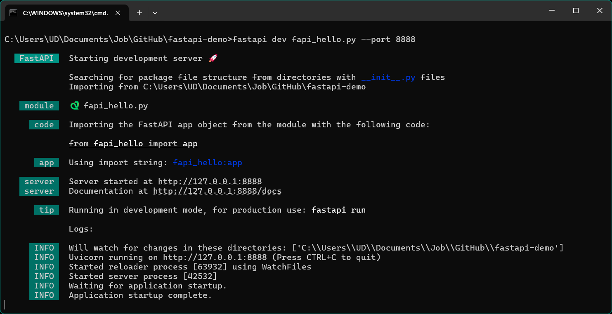

# Введение в FastAPI

## Содержание

1. [Введение](#введение)
2. [Основные принципы REST API](#основные-принципы-rest-api)
3. [Ключевые компоненты REST API](#ключевые-компоненты-rest-api)
4. [Методы REST API](#методы-rest-api)
5. [RESTful API](#restful-api)
6. [Безопасность в REST API](#безопасность-в-rest-api)
7. [Тестирование REST API](#тестирование-rest-api)
8. [Примеры использования REST API](#примеры-использования-rest-api)

### Введение

Источники:
- [FastAPI](https://fastapi.tiangolo.com/)
- [Tutorial - User Guide @ FastAPI](https://fastapi.tiangolo.com/tutorial/)
- [Tutorial - User Guide RU @ FastAPI](https://fastapi.tiangolo.com/ru/tutorial/)
- [Микросервисы (Microservices) @ Хабр](https://habr.com/ru/articles/249183/)
- [Микросервис на Python+ FastAPI @ Хабр](https://habr.com/ru/articles/799337/)

`REST API` &ndash; архитектурный паттерн для создания веб-сервисов. REST &ndash; набор правил, которые описывают лучшие практики обмена данными между клиентами и серверами. Они используют HTTP-запросы для манипулирования данными и взаимодействия с веб-сервисами. API REST не имеют статистики, кэшируются и согласованы. Подробнее: [REST API](rest_api.md).

`FastAPI` &ndash; это современный, высокопроизводительный веб-фреймворк для создания API на Python, основанный на стандартных аннотациях типов Python. Является одним из наиболее популярных веб-фреймворков для реализации микросервисов на Python после `Django` и `Flask`.

#### Микросервисы vs монолит

Монолит &ndash; приложение, построенное как единое целое. Enterprise приложения часто включают три основные части: пользовательский интерфейс (HTML страницы, javascript и т.п.), база данных и сервер. Серверная часть обрабатывает HTTP запросы, выполняет доменную логику, запрашивает и обновляет данные в БД, заполняет HTML страницы, которые затем отправляются браузеру клиента. Любое изменение в системе приводит к пересборке и развертыванию новой версии серверной части приложения. В монолитной архитектуре каждая бизнес-логика находится в одном приложении. Службы приложений, такие как управление пользователями, аутентификация и другие функции, используют одну и ту же базу данных.

Архитектурный стиль микросервисов &ndash; это подход, при котором единое приложение строится в виде набора небольших сервисов (легковесных приложений), каждый из которых работает в отдельном процессе и осуществляет взаимодействие с остальными сервисами с использованием легковесных механизмов, как правило HTTP. Эти сервисы построены вокруг бизнес-потребностей и развертываются независимо с использованием полностью автоматизированной среды. Сами по себе эти сервисы могут быть написаны на разных языках и использовать разные технологии хранения данных. Межсервисное взаимодействие также может осуществляться с использованием очередей сообщений, таких как `RabbitMQ`, `Kafka` или `Redis`.

Подробнее в [Микросервисы (Microservices) @ Хабр](https://habr.com/ru/articles/249183/) и [Микросервис на Python+ FastAPI @ Хабр](https://habr.com/ru/articles/799337/).

#### FastAPI

Официальная документация представляет достаточно обширный материал в виде пошагового руководства.

> Примеры кода далее рассчитаны на локальный дебаг-деплой для отладки кода, нежели на "боевое" развертывание внутри контейнера. 

### Hello, FastAPI

Установка библиотеки `fastapi` и веб-сервера `uvicorn`:

```bash
pip install fastapi[standard-no-fastapi-cloud-cli] uvicorn
```

Простейшее приложение (для примера скрипт `fapi_hello.py`:

```python
from fastapi import FastAPI

app = FastAPI()


@app.get("/")
async def root():
    return {"message": "Hello, FastAPI!"}
```

Запуск в терминале/cmd с указанным портом:

```bash
fastapi dev fapi_hello.py --port 8888
```

<div align="center">
  
  <p style="text-align: center">
    Рисунок 1 &ndash; Запуск в cmd
  </p>
</div>

Если перейти по адресу `127.0.0.1:8888`, то в окне браузеры должно появиться следующее:

```html
{"message":"Hello, FastAPI!"}
```

При этом в консоль отобразится лог GET-запроса:

```html
"GET / HTTP/1.1" 200
```

Одной из отличительной особенностью FastAPI является автоматическая генерация *интерактивной* документации согласно спецификации OpenAPI, доступной по адресу:
- `/docs` &ndash; сгенерировано [Swagger UI](https://github.com/swagger-api/swagger-ui)
- `/redoc` &ndash; сгенерировано [Redoc](https://github.com/Redocly/redoc)

На данных страницах можно протестировать API бекэнда без использования фронтэнда в интерактивном режиме. Например, подставить значения в предоставленные поля POST-запроса и получить ответ от сервера.

<div align="center">
  
  <p style="text-align: center">
    Рисунок 2 &ndash; Автоматическая документация от Swagger UI
  </p>
</div>

<div align="center">
  
  <p style="text-align: center">
    Рисунок 3 &ndash; Автоматическая документация от Redoc
  </p>
</div>