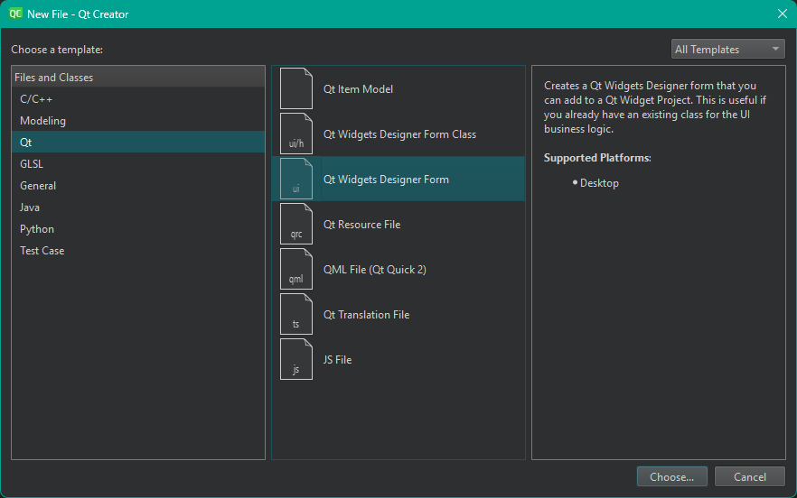
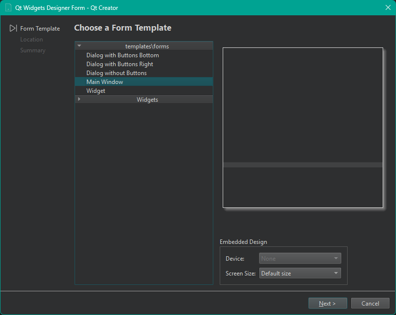
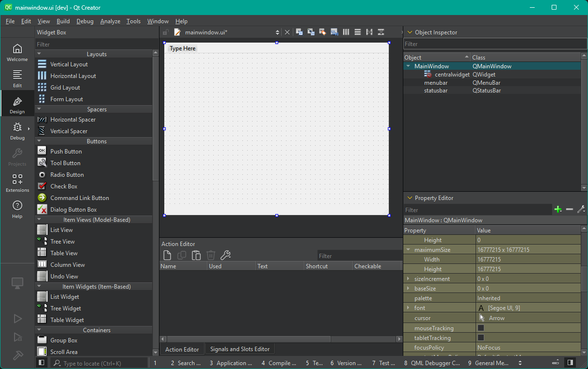
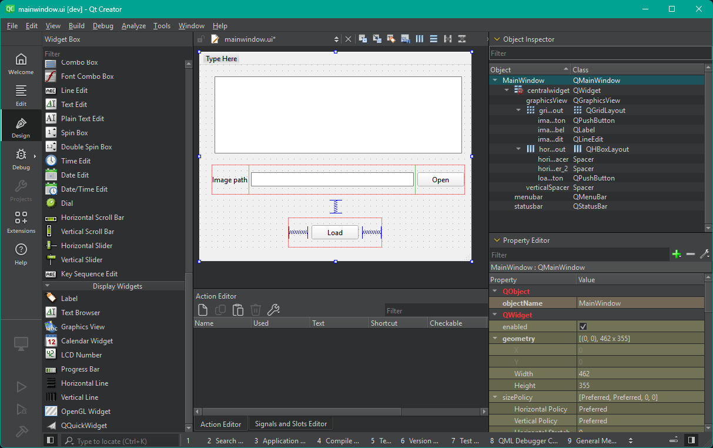
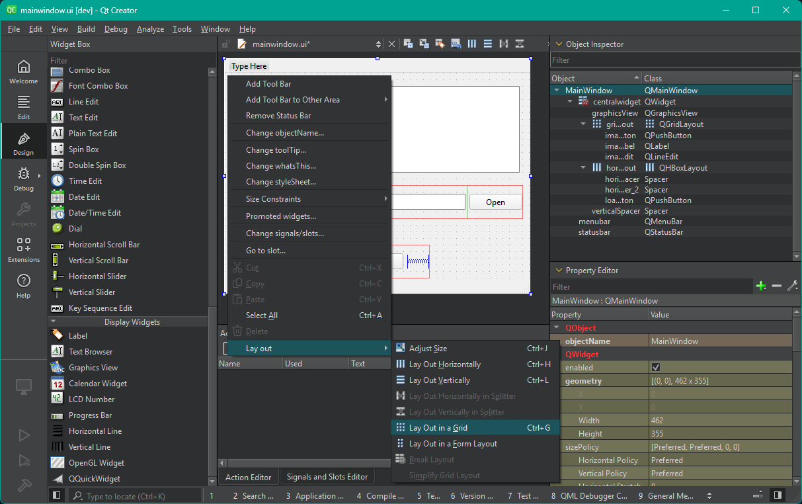
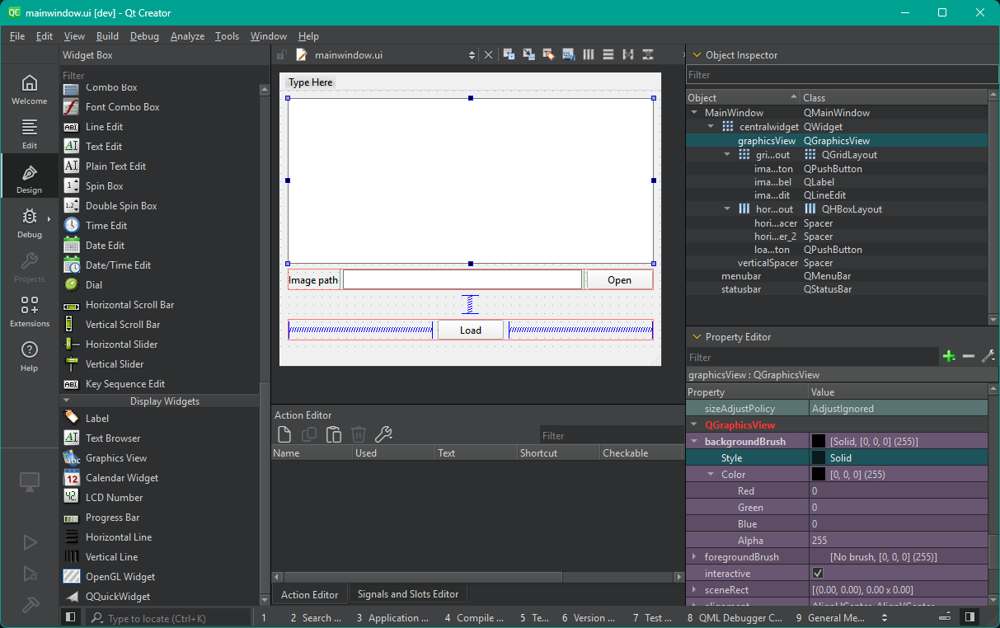
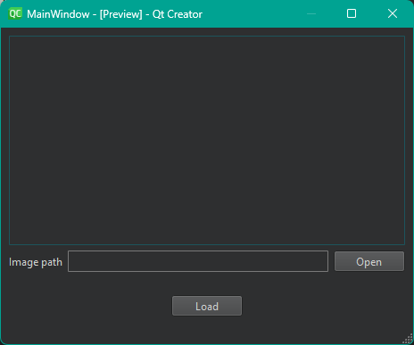

# Введение в Qt

## Содержание

1. [Введение](#введение)
2. [Прототипирование UI](#прототипирование-ui)
3. [Hello Qt GUI world](#hello-qt-gui-world)
4. [Механизм signal-slot](#механизм-signal-slot)
5. [GUI и worker threads](#gui-и-worker-threads)
6. [Пример использования диалогового окна выбора файла](#пример-использования-диалогового-окна-выбора-файла)

### Введение

Источники:
- [Qt Documentation @ Qt Docs](https://doc.qt.io/)
- [All C++ Classes @ Qt Docs](https://doc.qt.io/qt-6/classes.html)
- [Signals & Slots @ Qt Docs](https://doc.qt.io/qt-6/signalsandslots.html)
- [Как работают сигналы и слоты в Qt (часть 1) @ Хабр](https://habr.com/ru/articles/214379/)
- [Определение и связь сигналов и слотов](https://metanit.com/cpp/qt/6.1.php)
- [Настраиваем окружение Qt6+QtC без VPN @ Хабр](https://habr.com/ru/articles/709064/)
- [PyQt6 — полное руководство для новичков @ Хабр](https://habr.com/ru/companies/skillfactory/articles/599599/)
- [Правильная работа с потоками в Qt @ Хабр](https://habr.com/ru/articles/467261/)

Qt &ndash; фреймворк для разработки кроссплатформенного программного обеспечения на языке программирования C++. Для многих языков программирования существуют обертки, например, для Python это [PySide2](https://pypi.org/project/PySide2/) и [PyQt](https://pypi.org/project/PyQt6/) (отличие в лицензиях и способе распространения).  

Qt представляет собой мощный фреймворк или платформу для разработки приложений с использованием различных программных компонентов:
- QtCore &ndash; классы ядра библиотеки, используемые другими модулями
- QtGui &ndash; компоненты графического интерфейса
- QtWidgets &ndash; содержит классы для классических приложений на основе виджетов, модуль выделен из QtGui в Qt 5
- Qt QML &ndash; модуль для поддержки QML (Javascript-style прототипирование GUI)
- QtNetwork &ndash; набор классов для сетевого программирования
- QtSvg &ndash; классы для отображения и работы с данными Scalable Vector Graphics (SVG)
- QtXml &ndash; модуль для работы с XML, поддерживаются модели SAX и DOM
- QtTest &ndash; классы для поддержки модульного тестирования
- QtQuick &ndash; модуль, предоставляющий декларативный фреймворк для создания динамичных, настраиваемых пользовательских интерфейсов
- и др.

Одна из лучших, если не лучшая, [документация](https://doc.qt.io/). [Список всех классов](https://doc.qt.io/qt-6/classes.html). Например, основной виджет главного окна графического приложения из модуля `QtWidgets` &ndash; [QMainWindow](https://doc.qt.io/qt-6/qmainwindow.html). Как правило, запись содержит краткое или подробное описание назначения класса, пример использования, члены класса (включая наследуемые), все ссылки кликабельны, что упрощает навигацию по смежным классам/методам.  

Отличительная особенность &ndash; использование метаобъектного компилятора (***MOC***) &ndash; предварительной системы обработки исходного кода. Расширение возможностей обеспечивается системой плагинов, которые возможно размещать непосредственно в панели визуального редактора (QtCreator &ndash; IDE all-in-one, или QtDesigner &ndash; приложение чисто для проектирования UI). Также существует возможность расширения привычной функциональности виджетов, связанной с размещением их на экране, отображением, перерисовкой при изменении размеров окна.  

В модуле QtCore реализован набор шаблонных классов на C++, расширяющих функциональность библиотеки STL (различные коллекции, hashable и прочее).  

Одной из мощных составляющих Qt является реализация ***[Model/View Programming](https://doc.qt.io/qt-6/model-view-programming.html)*** (по аналогии с MVP паттерном программирования).  

Одной из самых известных фишек Qt является механизм сигналов и слотов &ndash; связывание срабатываемого в приложении события и его обработчика. Прежде чем перейти к данному механизму, рассмотрим проектирование графического интерфейса на простом примере.

### Прототипирование UI

Для создания формы графического интерфейса приложения необходимо воспользоваться IDE QtCreator.

> P.S.: с релизом Qt 6 версии установка фреймворка переехала в онлайн формат с проверкой лицензии (ввод логина и пароля учетной записи), в связи с известными событиями установка затруднена с *определенных* IP адресов. Зеркала вроде еще функционируют (см. [Настраиваем окружение Qt6+QtC без VPN @ Хабр](https://habr.com/ru/articles/709064/)). Один из способов получить Open source версию C++ SDK (а это и IDE) &ndash; использование системных пакетов в Linux, однако, версия значительно запаздывает. Например, в текущей LTS Ubuntu (24.04) Qt версии 6.4.2, а latest версия &ndash; 6.10.0.
> P.S.S.: зеркало Яндекса отваливается :/

> Официальный QtCreator можно скачать с зеркал, например, [отсюда](https://www.nic.funet.fi/pub/mirrors/download.qt-project.org/official_releases/qtcreator/latest/). Неофициально [отсюда](https://github.com/qt-creator/qt-creator). Еще один способ &ndash; поставить через `pip`: [pyqt6-tools](https://pypi.org/project/pyqt6-tools/) (не пробовал).

После установки и запуска QtQreator `File` &rarr; `New File...` &rarr; `Qt` &rarr; `Qt Widgets Designer Form`:

<div align="center">
  
  <p style="text-align: center">
    Рисунок 1 &ndash; Wizard создания UI файла
  </p>
</div>

Далее необходимо выбрать шаблон `Main Window` &ndash; основное (главное) окно приложения:

<div align="center">
  
  <p style="text-align: center">
    Рисунок 2 &ndash; Wizard создания UI файла
  </p>
</div>

Далее необходимо указать путь и имя файла. Пусть будет `mainwindow.ui`. Откроется вкладка `Design` IDE:

<div align="center">
  
  <p style="text-align: center">
    Рисунок 3 &ndash; Дизайн UI файла
  </p>
</div>

В центральной части IDE расположено интерактивное превью с поддержкой drag-n-drop графических контролов (элементов) &ndash; виджетов на левой панели IDE. Вверху справа расположено дерево элементов, описывающее структуру UI. Нижняя часть панели справа представляет собой таблицу свойств текущего выбранного виджета. Данные свойства не статичны, их можно изменить в коде приложения.  

Добавим графические элементы на пустую форму.  
Для отображения растровых и векторных изображений добавим элемент `Graphics View` из раздела `Display Widgets`.  

> Имя объекта виджета (поле `objectName`) нам понадобится далее. Имя должно быть уникальным, иначе IDE по умолчанию добавит суффикс-индекс вида element_2, _3 и т.д. Имеет смысл в качестве суффикса оставить имя объекта по умолчанию &ndash; `graphicsView` в нашем случае. В качестве префикса желательно вписать имя, несущее функциональный смысл &ndash; для чего предназначена та или иная кнопка.  
> Имя виджета может еще не раз понадобиться в коде, так что отсутствие фантазии может привести в дальнейшем к веселому процессу рефакторинга.

Далее разместим поле ввода пути для входного изображения. Для этого необходимо сначала добавить надпись (метку) &ndash; `Label`. Возможно, таких полей ввода у нас будет множество, поэтому имеет смысл поместить их в отдельный контейнер виджетов для облегчения процесса разметки (расположения) виджетов &ndash; один из вспомогательных виджетов раздела `Layouts`. Самый общий это `Grid Layout`, который определяет прямоугольную сетку расположения виджетов. В него добавим виджет `Label`, затем справа от него виджет `Line edit` (раздел `Input Widgets`) и кнопку открытия диалогового окна выбора файла `Push Button`. Разместим получившийся `Grid Layout` с тремя элементами под `Graphics View`.  

Далее добавим основную кнопку `Load`, по нажатию на которую входное изображение будет загружено и отображено в графическом интерфейсе пользователя. Для красоты разместить кнопку можно посередине. Для этого добавим лэйаут `Horizontal Layout`, добавим в него кнопку, а слева и справа добавим вспомогательные виджеты &ndash; `Horizontal Spacer` &ndash; которые подожмут кнопку слева и справа, дабы кнопка не растянулась во всю ширину окна. Вертикальный спейсер добавим над `Horizontal Layout`, в свойстве `sizeType` укажем `Fixed`.
> У каждого виджета есть геометрия &ndash; условно, 2D bounding box, так же есть политика изменения размера &ndash; `sizePolicy`, `sizeHint` &ndash; которые совместно с политиками виджета-предка (parent) определяют геометрию и расположение виджета на форме. Условно, что делать виджету при изменении размера окна &ndash; растягиваться, сжиматься, или иметь фиксированный размер? Можно заметить, что есть свойства минимально и максимально допустимых размеров виджета.

Должно получиться что-то вроде такого:

<div align="center">
  
  <p style="text-align: center">
    Рисунок 4 &ndash; Дизайн UI файла, первоначальное размещение виджетов
  </p>
</div>

Если оставить форму в таком виде, то положение размещённых виджетов, как и их размер, останутся фиксированными при изменении размеров окна. Для динамического изменения размеров и положения необходимо задать разметку (layout) самого `MainWindow`. У виджетов `MainWindow`, `QWidget` (базовый класс виджетов) есть встроенный член класса лэйаут &ndash; `centralwidget`. Можно кликнуть по `MainWindow` в дереве виджетов или в пустом месте формы, в контекстном меню выбрать `Lay out` &rarr; `Lay Out in a Grid`:

<div align="center">
  
  <p style="text-align: center">
    Рисунок 5 &ndash; Дизайн UI файла, первоначальное размещение виджетов
  </p>
</div>

Вуаля, виджеты заняли посадочные места согласно разметке:

<div align="center">
  
  <p style="text-align: center">
    Рисунок 6 &ndash; Дизайн UI файла, финальное размещение виджетов
  </p>
</div>

> Иногда приходится вручную поменять после этого расположение виджетов, например, растянуть один виджет на несколько ячеек сетки лэйаута (row span, column span).

На рисунке 6 у объекта класса `QGraphicsView` изменено свойство заливки фона `backgroundBrush` &rarr; `Style` &rarr; `Solid`. Визуально сейчас это никак не проявится ни в режиме педактирования UI, ни в режиме просмотра:

<div align="center">
  
  <p style="text-align: center">
    Рисунок 7 &ndash; Превью UI файла
  </p>
</div>

> На Windows системах есть особенность, если выбрать в настройках IDE тему оформления (на скриншотах Flat Dark), то при компиляции UI файлов подцепится тема оформления IDE.
> P.S.: вообще, большинство виджетов кастомизируются с использованием Qt style sheets &ndash; по аналогии с CSS в веб-дизайне, только для классов Qt:
> - [Qt Style Sheets Reference](https://doc.qt.io/qt-6/stylesheet-reference.html)
> - [Qt Style Sheets Examples](https://doc.qt.io/qt-6/stylesheet-examples.html)  
> 
> Данный стайлинг можно делать в статичном виде через IDE через поле `styleSheet` у каждого элемента или у объекта-предка с указанием имен или классов его потомков (правила наследования как в CSS). Вообще, имеет смысл написать отдельный QSS и динамически его подгрузить при запуске приложения, а еще лучше: написать SASS/SCSS файл, который компилируется в QSS (в SCSS можно юзать глобальные константы, например, для цвета, и ссылаться на них при написании правил стилизаций элементов). В последнем случае можно создать разные темы оформления. Правда, не все можно изменить с использованием QSS, например, в сочетании с наступлением каких-нибудь событий, тогда приходится *we need to go deeper*: наследоваться от класса виджета и переопределять методы, отвечающие за низкоуровневую отрисовку геометрии виджета &ndash; *paintEvent* и прочие. Но это совсем другая история...

UI файл можно сохранить. Структурно он представляет собой XML файл. MOC при запуске скомпилирует его в промежуточный файл. В плюсах, например, это будет отдельный заголовочный файл со своим namespace, который необходимо будет включить в основной .h/.cpp и юзать его через промежуточный объект, который будет содержать проинициализированные объекты виджетов в качестве членов класса, например:

```cpp
MainWindow::MainWindow(QWidget *parent) :
    QMainWindow(parent),
    ui(new Ui::MainWindow)
{
    ui->setupUi(this);
    ui->slit_graphicsView->installEventFilter(this);
    ui->slit_graphicsView->setScene(&_slitGraphicsScene);
}
```

В Питоне можно тоже скомпилировать UI в .py файл. Оба примера это "статический способ", что не очень удобно при рефакторинге имен, например, да и нужен предварительный этап компиляции перед запуском. В пакете PyQt есть отдельный модуль `uic`, который может загрузить UI файл и вернуть инстанс с инициализированными виджетами.

### Hello Qt GUI world

Создадим `hello.py` &ndash; скрипт с точкой входа нашего GUI приложения. Минималистично код выглядит так:

```python
from PyQt6.QtWidgets import QApplication, QMainWindow
from PyQt6 import uic
import sys


class HelloWindow(QMainWindow):
    def __init__(self):
        super(HelloWindow, self).__init__()
        uic.loadUi('mainwindow.ui', self)


def main():
    app = QApplication(sys.argv)
    app.setStyle('WindowsVista')
    hw = HelloWindow()
    hw.show()
    sys.exit(app.exec())


if __name__ == '__main__':
    main()
```

`QApplication` является основным классом для GUI приложений на Qt (есть еще схожий `QConsoleApplication` для чисто консольных апп). Данный класс запускает ***основной*** GUI поток (thread), в котором крутится поток событий (event loop) ***всего*** GUI приложения. Запуск в этом же потоке вычислительно затратных операций негативно скажется на производительности отрисовки любых графических элементов (кстати, у каждого контрола есть свой event loop!) вплоть до фриза. При этом события будут напихиваться в очередь на обработку, и так быстро этот фарш не прокрутится.

Итак, `HelloWindow` наследуется от `QMainWindow`. В ините мы инициализируем все добро класса-предка. Данная строка

```python
uic.loadUi('mainwindow.ui', self)
```

компилит UI файл на лету, графические элементы падают в члены self с именами, указанными в UI файле.  

В точке входа мы инициализируем объект класса `QApplication`, причем в конструктор передаем `sys.argv` (а вдруг GUI приложуха запускается из командной строки с передачей аргументов).  

Данная строка патчит принудительно устанавливаемую тему оформления от IDE:

```python
    app.setStyle('WindowsVista')
```

Инициализируем наш GUI объект, выводим окно на экран и асинхронно возвращаем код завершения работы приложения:

```python
    hw = HelloWindow()
    hw.show()
    sys.exit(app.exec())
```

`app.exec()` запускает event loop основного потока GUI приложения.  

Что там про боль рефакторинга? Мы можем инициализировать свои переменные-виджеты с использованием метода `findChild`:

```python
    uic.loadUi('mainwindow.ui', self)
    self.ui_image_input_path_line_edit: QLineEdit = self.findChild(QLineEdit, "imageInputPath_lineEdit")
    self.ui_image_input_path_open_button: QPushButton = self.findChild(QPushButton, "imageInputPathOpen_pushButton")
    self.ui_load_input_image_button: QPushButton = self.findChild(QPushButton, "loadInputImage_pushButton")
```

Явное указание типа (type hint) нужно для "интеллисенса" IDE, ибо `findChild` возвращает объект типа `QObject`. `QObject` является базовым классом всех классов в Qt, связанных с метаобъектной моделью (тот самый MOC). В `findChild` мы в явном виде передаем тип разыскиваемого объекта и его имя. Теперь с рефакторингом проблем не будет, немного оверхед спагетти-кода.

> Для корректной распознавания типов PyQt, включая сигналы, линтером IDE необходимо установить:
> ```bash
> pip install PyQt6-stubs
> ```

#### Отображение изображения в QGraphicsView

[QGraphicsView](https://doc.qt.io/qt-6/qgraphicsview.html) используется для отображения графических элементов сцены [QGraphicsScene](https://doc.qt.io/qt-6/qgraphicsscene.html).

`QGraphicsScene` представляет собой контейнер для 2D графических элементов `QGraphicsItems`:
- графические примитивы
  + линия &ndash; [QGraphicsLineItem](https://doc.qt.io/qt-6/qgraphicslineitem.html)
  + прямоугольник &ndash; [QGraphicsRectItem](https://doc.qt.io/qt-6/qgraphicsrectitem.html)
  + круг (эллипс) &ndash; [QGraphicsEllipseItem](https://doc.qt.io/qt-6/qgraphicsellipseitem.html)
  + надпись &ndash; [QGraphicsTextItem](https://doc.qt.io/qt-6/qgraphicstextitem.html)
  + и т.п.
- [QGraphicsPixmapItem](https://doc.qt.io/qt-6/qgraphicspixmapitem.html) &ndash; класс для отображения растровых изображений [QPixmap](https://doc.qt.io/qt-6/qpixmap.html)
- и др.

Все эти классы являются частью [Graphics View Framework](https://doc.qt.io/qt-6/graphicsview.html).

Для отображения изображения в `QGraphicsView` нам потребуются:
- объект `QGraphicsView`
- объект `QGraphicsScene`
- объект `QGraphicsPixmapItem`
- объект `QImage`
- само изображение, считанное в `QImage` сразу или через другие библиотеки (OpenCV, Pillow и др.)

Допустим, UI форму мы компилируем на лету, и в `__init(self)__`:

```python
self.ui_graphics_view: QGraphicsView = self.findChild(QGraphicsView, 'graphicsView')
self.graphics_scene = QGraphicsScene(self)
self.graphics_pixmap_item = QGraphicsPixmapItem()
self.image_qt: Optional[QImage] = None  # в Qt есть свой класс для работы с изображениями - QImage
self.image: Optional[np.ndarray]
```

Пример вспомогательной функции для конвертации изображения, считанного с помощью OpenCV, в `QImage`:

```python
def image_to_qimage(image: np.ndarray, image_format: QImage.Format = QImage.Format.Format_RGB888):
    total_bytes = image.nbytes
    bytes_per_line = int(total_bytes / image.shape[0])
    image_qt = QImage(image, image.shape[1], image.shape[0], bytes_per_line, image_format)
    return image_qt
```

Пример кода добавления изображения на сцену `QGraphicsScene` и установки сцены у `QGraphicsView`:

```python
self.image_qt = self.image_to_qimage(self.image)
self.graphics_pixmap_item.setPixmap(QPixmap.fromImage(self.image_qt))
self.graphics_scene.setSceneRect(self.graphics_pixmap_item.boundingRect())
self.graphics_scene.addItem(self.graphics_pixmap_item)
```

> У каждого виджета и графического элемента из `Graphics View Framework` есть своя геометрия. Геометрия самого элемента и его отображения (рендера) &ndash; не одно и то же! Про геометрию оконных виджетов (`QMainWindow`, `QWidget` и т.п.) можно почитать в [Window Geometry](https://doc.qt.io/qt-6/application-windows.html#window-geometry), про геометрию элементов из `Graphics View Framework` в [The Graphics View Coordinate System](https://doc.qt.io/qt-6/graphicsview.html#the-graphics-view-coordinate-system).

### Механизм signal-slot

Механизм сигналов и слотов представляет одну из отличительных особенностей Qt и позволяют сделать приложение отзывчивым, реагировать на действия пользователя, отслеживать различные события в приложении. Так, когда пользователь выполняет какое-либо действие с каким-либо элементом пользовательского интерфейса, должна быть выполнена определенная задача. Например, если пользователь нажимает кнопку "Закрыть" в верхнем правом углу окна, то ожидается, что окно закроется. То есть необходим механизм для отслеживания событий и реагирования на них. В среде Qt такой механизм предоставляют сигналы и слоты.

Сигнал &ndash; это сообщение, которое передается, чтобы сообщить об изменении состояния объекта. Сигнал может нести информацию о произошедшем изменении.

Слот &ndash; это специальная функция, вызываемая в ответ на определенный сигнал. Поскольку слоты &ndash; это функции, они содержат логику для выполнения определенного действия.

> При этом сигналы и слоты не связаны именно с GUI контролами. Данный механизм удобно использовать и в консольных приложениях, особенно при реализации асинхронного взаимодействия различных модулей, в том числе живущих в разных потоках одного процесса. В Qt есть свои потоки &ndash; `QThread`. Есть свои особенности, подробнее: [Threading in a PyQt application: Use Qt threads or Python threads? @ stackoverflow](https://stackoverflow.com/questions/1595649/threading-in-a-pyqt-application-use-qt-threads-or-python-threads). Multithreading в целом является отдельной темой вне контекста Qt.  

Встроенные виджеты Qt имеют множество предопределенных сигналов. Но также можно расширять имеющиеся классы и добавлять к ним свои собственные сигналы. Аналогичным образом можно добавить свои собственные слоты для обработки сигнала. Сигналы и слоты упрощают реализацию паттерна Observer (Наблюдатель), избегая при этом шаблонного кода.

Синтаксически сигнал представляет определение функции без тела. И для нее не надо определять реализацию. В Python обертке сигналы инициализируются до `__init__`.  
В качестве слота может выступать потенциально любая функция, которая соответствует сигнатуре сигнала.  
Обычно сигналы генерируются объектами, когда они меняют свое состояние. Причем объект-генератор сигнала не знает и не заботится о том, получает ли другой объект сгенерированный сигнал. Благодаря такой композиции можно создавать независимые компоненты. При этом для одного сигнала можно подключить множество слотов. Аналогично один слот может обрабатывать несколько сигналов. Можно даже подключить сигнал напрямую к другому сигналу (при этом второй сигнал будет генерироваться сразу же, как только будет испущен первый.)

### GUI и worker threads

При каждом взаимодействии с приложением &ndash; будь то нажатие клавиши, щелчок или движение мыши &ndash; генерируется событие, которое помещается в очередь событий. В цикле событий очередь проверяется на каждой итерации: если найдено ожидающее событие, оно вместе с управлением передаётся определённому обработчику этого события. Последний обрабатывает его, затем возвращает управление в цикл событий и ждёт новых событий. Для каждого приложения выполняется *только один цикл событий*.

Класс `QApplication` содержит цикл событий Qt (нужен один экземпляр QApplication). Приложение ждёт в цикле событий новое событие, которое будет сгенерировано при выполнении действия. Всегда выполняется только один цикл событий.

Среди всех потоков Qt обязательно выделяет один «главный» (`main thread`), который в случае с UI-приложениями так же становится GUI thread. В этом потоке живет объект `QApplication` (`QCoreApplication` / `QGuiApplication`) который обслуживает основной `event loop`, ориентированный на работу с сообщениями от операционной системы. Поэтому использование главного потока для вычислений или любых других операций, которые могут блокировать обработчик событий &ndash; плохая идея.

Распространенный подход в таком сценарии &ndash; поместить логику в специальный `Worker Object`, отнаследованный от `QObject`, поместить последний в стандартный `QThread` и управлять `Worker`-ом с помощью сигналов.

> Наследование как минимум от `QObject` необходимо для использования механизма сигналов и слотов Qt. `QObject` является базовым классом для других классов фреймворка.

> Если нужно выделить метод без сложной логики (требующий отдельного класса для хранения переменных/сложных данных) с вычислениями в отдельный поток, то можно воспользоваться `QThread` или `QtConcurrent`, но это отдельная тема.

Про потоки в Qt очень хорошо простыми словами написано в [Правильная работа с потоками в Qt @ Хабр](https://habr.com/ru/articles/467261/).

#### Пример

```python
class Logger(QObject):
    def __init__(self):
        super(Logger, self).__init__()

        self.log_file_path = ""
        self.log_file = QFile()
        self.log_text_stream = QTextStream()
        self.class_name_dict = dict()
        self.abbr_max_len = 0

        self.um = UtilityMethods()
        self.um.current_time_format = "hh:mm:ss.zzz"
    ...
    @pyqtSlot(str)
    @pyqtSlot(str, int)
    def write(self, message, message_type=MessageType.INF):
        sender_name = self.get_sender_name()
        d, t = self.um.get_current_date_string(), self.um.get_current_time_string()
        m_list = message.split(os.linesep)
        m_list = [m for m in m_list if m.rstrip() != ""]
        for m in m_list:
            self.log_text_stream << f"[{d} {t}] : [{sender_name:>{self.abbr_max_len}}] : " \
                                    f"[{MessageType(message_type).name}] : {m}\n"
        self.log_text_stream.flush()
    ...
...

class MultiDeviceGrabber(QObject):
    log_message = pyqtSignal([str], [str, int])  # сигнал с разным набором передаваемых аргументов
    device_released = pyqtSignal()  # сигнал без аргументов
    ...
    def __init__(self):
        super(MultiDeviceGrabber, self).__init__()
        # Logger
        self.logger = Logger()
        self.logger_t = QThread(self)  # создаем новый поток QThread
        self.logger_t.start()  # стартуем его
        self.logger.moveToThread(self.logger_t)  # перемещаем объект в другой поток
        ...
        self.log_message[str].connect(self.logger.write)
        self.log_message[str, int].connect(self.logger.write)
        ...
        self.device_released.connect(self.on_device_released)
    ...

    ...
        # Примеры
        # Синтаксис "испускания" сигнала без аргументов
        self.device_released.emit()
        # Синтаксис "испускания" сигнала с вариантом аргумента по умолчанию - str
        self.log_message.emit("Grabbers are initialized successfully.")
        # Синтаксис "испускания" сигнала с указанием набора аргументов
        self.log_message[str, int].emit("Initialization is aborted.", MessageType.ERR)
```

> Если соединить сигналы со слотами до перемещения объекта в новый поток, то слоты `Logger`'а ***будут обрабатываться не в новом потоке `self.logger_t`, а в том потоке, в котором был инициализирован объект `self.logger`***!

> Наличие декоратора @pyqtSlot(<типы аргументов>) &ndash; опционально, дабы отличить слот от обычной функции.

### Пример использования диалогового окна выбора файла

Пусть у нас есть форма:

<div align="center">
  
  <p style="text-align: center">
    Рисунок 8 &ndash; Дизайн UI файла, первоначальное размещение виджетов
  </p>
</div>

```python
class HelloWindow(QMainWindow):
    def __init__(self):
        super(HelloWindow, self).__init__()
        uic.loadUi('mainwindow.ui', self)
        self.ui_image_input_path_line_edit: QLineEdit = self.findChild(QLineEdit, "imageInputPath_lineEdit")
        self.ui_image_input_path_open_button: QPushButton = self.findChild(QPushButton, "imageInputPathOpen_pushButton")
        self.ui_load_input_image_button: QPushButton = self.findChild(QPushButton, "loadInputImage_pushButton")

        self.image_file_path = ""
        self.image: Optional[np.ndarray] = None

        # Connect signals with slots
        self.ui_image_input_path_open_button.clicked.connect(self.on_ui_load_input_image_button_clicked)
```

У кнопки `QPushButton` есть стандартный сигнал `clicked` нажатия на эту самую кнопку. Его мы соединим со слотом `on_ui_load_input_image_button_clicked`. В Qt есть класс [QFileDialog](https://doc.qt.io/qt-6/qfiledialog.html), в котором реализованы диалоговые окна работы с файловой системой ОС (открытие/выбор файла/директории, сохранение файла). В нашем случае воспользуемся статическим методом `getOpenFileName`:

```python
    @pyqtSlot()
    def on_ui_load_input_image_button_clicked(self):
        file_path, _filter = QFileDialog.getOpenFileName(self, "Choose file", "",
                                                         "Image file (*.bmp *.png *.jpg *.tif)")
        if file_path != "":
            self.image_file_path = file_path
            self.ui_image_input_path_line_edit.setText(self.image_file_path)
```

Логику считывания изображения можно поместить как в этот слот, так и в слот по клику на кнопку `Load`, например.